# Campus Buddy 校园互助与资源共享平台 - 软件设计规格说明书

**文档版本:** 1.0  
**更新日期:** 2025年5月29日

## 文档目录

1. **引言**
   1.1 文档目的  
   1.2 项目背景  
   1.3 系统概述  
   1.4 参考资料  

2. **系统架构设计**
   2.1 总体架构  
   2.2 前端架构  
   2.3 后端架构  
   2.4 模块依赖关系  
   2.5 通信机制  

3. **数据设计**
   3.1 实体关系图  
   3.2 数据库设计  
   3.3 数据安全策略  

4. **核心功能模块设计**
   4.1 用户管理模块  
   4.2 互助信息模块  
   4.3 学习小组模块  
   4.4 好友系统模块  
   4.5 即时通讯模块  
   4.6 通知系统模块  
   4.7 文件管理模块  
   4.8 评价系统模块  

5. **系统流程设计**
   5.1 互助功能流程  
   5.2 学习小组流程  
   5.3 好友与通讯流程  
   5.4 认证授权流程  

6. **安全设计**
   6.1 认证与授权机制  
   6.2 数据加密策略  
   6.3 输入验证  
   6.4 防攻击措施  

7. **性能优化设计**
   7.1 缓存策略  
   7.2 数据库优化  
   7.3 前端性能优化  

8. **部署架构**
   8.1 系统部署图  
   8.2 高可用设计  
   8.3 扩展性设计  

9. **附录**
   9.1 术语表  
   9.2 图表索引  

---

# 1. 引言

## 1.1 文档目的

本文档是 Campus Buddy（校园互助与资源共享平台）的软件设计规格说明书，旨在详细描述系统的架构设计、数据结构、功能模块、流程设计、安全机制以及部署方案。文档面向开发团队、测试团队以及项目相关的技术人员，为系统的开发、测试、维护和升级提供技术参考和指导。

## 1.2 项目背景

随着高校教育的发展，学生在学习过程中遇到的问题和需求日益多样化。传统的线下互助方式存在信息不对称、资源利用率低、时间地域限制等问题。Campus Buddy 平台旨在构建一个全面的校园互助生态系统，通过互联网技术打破时空限制，提高校园资源利用效率，促进知识共享和互助协作。

## 1.3 系统概述

Campus Buddy 是一个面向高校师生的互助与资源共享平台，主要包括以下核心功能：

1. **互助信息发布与响应**：用户可以发布学习问题、资源需求、技能互换等互助信息，其他用户可以浏览、搜索并提供帮助。
2. **学习小组管理**：支持创建、加入和管理学习小组，促进小组成员之间的协作学习。
3. **好友系统**：用户可以添加好友，形成稳定的互助关系网络。
4. **即时通讯**：提供实时的私聊功能，方便用户进行一对一交流。
5. **通知系统**：实时推送系统消息、互助请求、好友申请等通知。
6. **文件共享**：支持文件上传、下载和管理，方便用户分享学习资料。
7. **评价系统**：互助完成后可进行评价，形成信用评分机制。

系统采用前后端分离架构，前端使用 Vue.js + Vite 开发，后端基于 Spring Boot 框架，数据存储采用 MySQL 和 Redis，文件存储使用对象存储服务。

## 1.4 参考资料

- 《Campus Buddy 需求规格说明书》
- Spring Boot 官方文档：https://spring.io/projects/spring-boot
- Vue.js 官方文档：https://vuejs.org/guide/introduction.html
- Redis 官方文档：https://redis.io/documentation
- MySQL 官方文档：https://dev.mysql.com/doc/

# 2. 系统架构设计

## 2.1 总体架构

Campus Buddy 平台采用分层架构设计，分为前端层、后端应用层和数据存储层。各层之间通过标准接口进行通信，保证系统的可扩展性和可维护性。

### 2.1.1 总体架构图

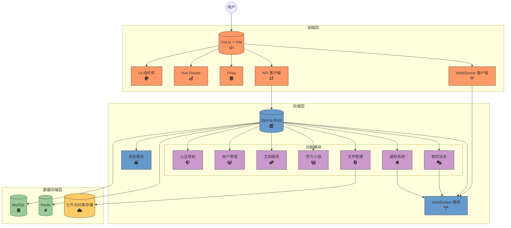

### 2.1.2 架构说明

1. **前端层**：
   - 采用 Vue.js 框架和 Vite 构建工具
   - 使用 Vue Router 进行路由管理
   - 使用 Pinia 进行状态管理
   - 通过 Axios 进行 HTTP 请求
   - 使用 WebSocket 实现实时通信

2. **后端层**：
   - 基于 Spring Boot 框架开发
   - 模块化设计，各功能模块独立实现
   - 提供 RESTful API 接口
   - WebSocket 服务支持实时通信
   - 安全服务处理认证和授权

3. **数据存储层**：
   - MySQL 数据库存储结构化数据
   - Redis 提供缓存服务
   - 七牛云对象存储用于文件存储

## 2.2 前端架构

前端采用组件化、模块化的设计思路，基于 Vue.js 框架和 TypeScript 语言开发。

### 2.2.1 前端架构图

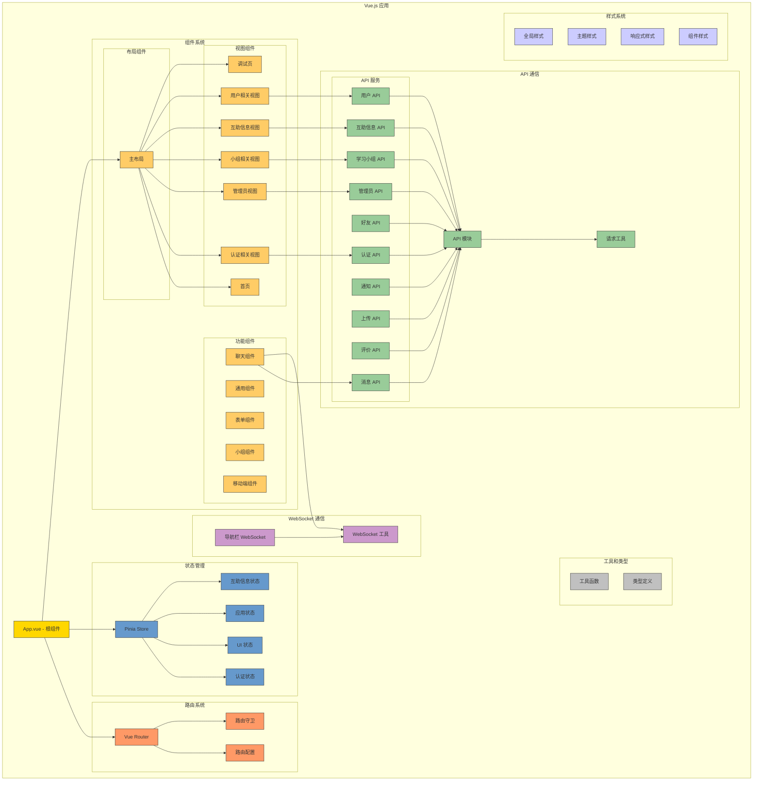

### 2.2.2 前端架构说明

1. **应用结构**：
   - 根组件（App.vue）作为应用入口
   - MainLayout 作为主要布局容器
   - 视图组件用于不同功能页面的展示

2. **路由系统**：
   - 使用 Vue Router 管理前端路由
   - 路由守卫处理权限控制和页面跳转逻辑

3. **状态管理**：
   - 采用 Pinia 进行状态管理
   - 将状态分为认证状态、UI状态、应用状态等模块

4. **API 通信**：
   - 封装 Axios 请求工具
   - 按功能模块划分 API 服务
   - 统一处理请求和响应

5. **WebSocket 通信**：
   - 封装 WebSocket 工具类
   - 实现实时消息推送

6. **组件系统**：
   - 布局组件负责页面结构
   - 功能组件实现可复用的UI交互
   - 视图组件整合功能组件形成完整页面

7. **工具和类型**：
   - 通用工具函数封装
   - TypeScript 类型定义

8. **样式系统**：
   - 全局样式定义基础风格
   - 主题样式实现明暗模式切换
   - 响应式样式适配不同屏幕

## 2.3 后端架构

后端采用基于 Spring Boot 的分层架构，遵循 RESTful API 设计规范，实现模块化和可扩展的系统结构。

### 2.3.1 后端架构图

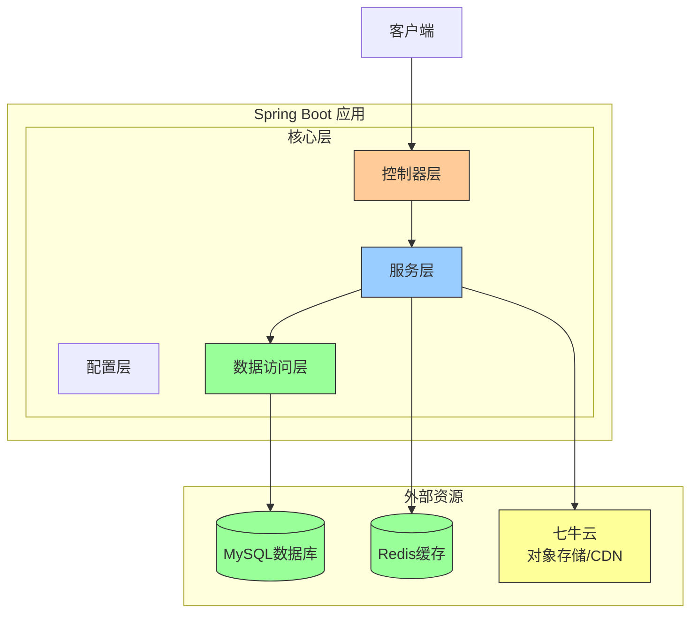

### 2.3.2 核心功能模块架构

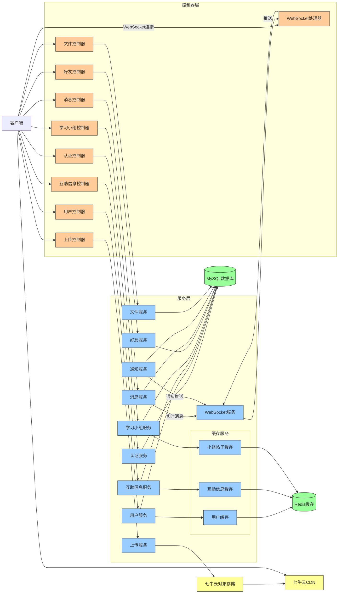

### 2.3.3 后端架构说明

1. **配置层**：
   - 应用全局配置、Web配置、安全配置
   - 缓存(Redis)配置、WebSocket配置
   - 文件存储配置、七牛云对象存储配置

2. **控制器层**：
   - 处理HTTP请求和响应
   - 调用服务层处理业务逻辑
   - 主要包括：认证、用户、互助信息、学习小组、好友关系、消息通知、文件管理、上传等控制器
   - WebSocket处理器：处理实时通信连接

3. **服务层**：
   - 实现核心业务逻辑
   - 处理数据校验和业务规则
   - 协调多个数据源访问
   - 缓存服务：分为用户缓存、互助信息缓存、小组帖子缓存
   - WebSocket服务：处理实时消息和通知推送

4. **数据访问层**：
   - 使用MyBatis与数据库交互
   - 实现基本的CRUD操作
   - 主要包括：用户、互助信息、小组、好友、消息等数据访问接口

5. **外部资源**：
   - MySQL数据库：持久化存储结构化数据
   - Redis缓存：存储用户会话、热点数据缓存
   - 七牛云：提供对象存储和CDN服务，用于文件上传和访问加速

3. **服务层**：
   - 实现业务逻辑
   - 调用数据访问层
   - 处理事务管理
   - 服务之间协作完成复杂功能

4. **数据访问层**：
   - 使用MyBatis进行数据库操作
   - 实现各实体的CRUD操作

5. **实体层**：
   - 定义数据模型
   - 映射数据库表结构

6. **工具和安全**：
   - JWT工具：处理令牌生成和验证
   - 文件工具：处理文件操作
   - WebSocket处理器：处理WebSocket连接和消息
   - 拦截器和过滤器：实现安全控制

7. **外部服务**：
   - 七牛云对象存储：存储用户上传的文件
   - 七牛云CDN：加速文件访问
   - WebSocket处理器：处理实时通信
   - 拦截器和过滤器：处理请求过滤和拦截

## 2.4 模块依赖关系

系统的各个功能模块之间存在一定的依赖关系，理解这些依赖关系有助于系统的维护和扩展。

### 2.4.1 模块依赖关系图

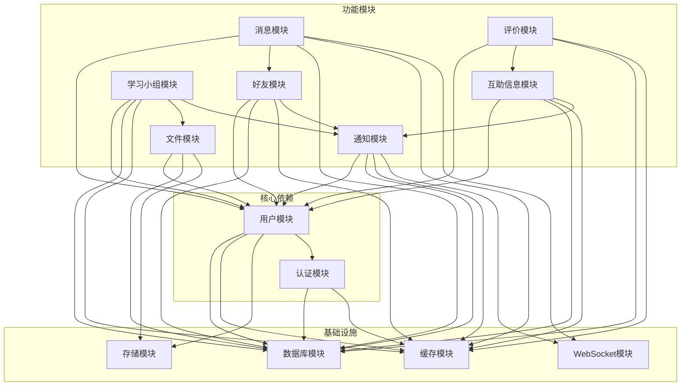

### 2.4.2 模块依赖说明

1. **核心依赖**：
   - 认证模块和用户模块是系统的基础
   - 几乎所有其他模块都依赖于这两个核心模块

2. **功能模块依赖**：
   - 互助信息模块依赖用户模块和通知模块
   - 学习小组模块依赖用户模块、文件模块和通知模块
   - 好友模块依赖用户模块和通知模块
   - 消息模块依赖用户模块、好友模块和WebSocket模块
   - 通知模块依赖用户模块和WebSocket模块
   - 文件模块依赖用户模块和存储模块
   - 评价模块依赖用户模块和互助信息模块

3. **基础设施依赖**：
   - 所有模块都依赖于数据库模块
   - 大部分模块依赖缓存模块提高性能
   - 需要实时通信的模块依赖WebSocket模块
   - 需要文件操作的模块依赖存储模块

## 2.5 通信机制

系统采用多种通信机制，包括HTTP请求、WebSocket实时通信等，以满足不同场景的需求。

### 2.5.1 WebSocket通信流程图

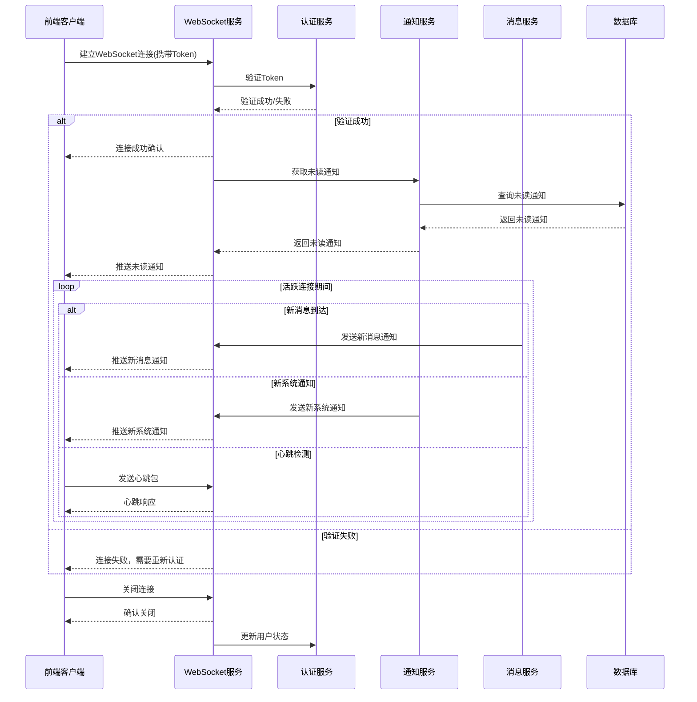

### 2.5.2 通信机制说明

1. **HTTP通信**：
   - RESTful API接口，用于常规数据交互
   - 采用JSON格式进行数据传输
   - 使用JWT进行身份验证

2. **WebSocket通信**：
   - 用于实时消息推送
   - 支持即时消息、通知、在线状态更新等
   - 连接建立时进行身份验证
   - 使用心跳机制保持连接

3. **内部模块通信**：
   - 服务间直接方法调用
   - 事件驱动机制处理异步操作
   - 使用消息队列处理高并发场景

# 3. 数据设计

## 3.1 实体关系图

Campus Buddy 平台的数据模型设计基于业务需求，建立了清晰的实体关系结构。以下是系统的实体关系图：

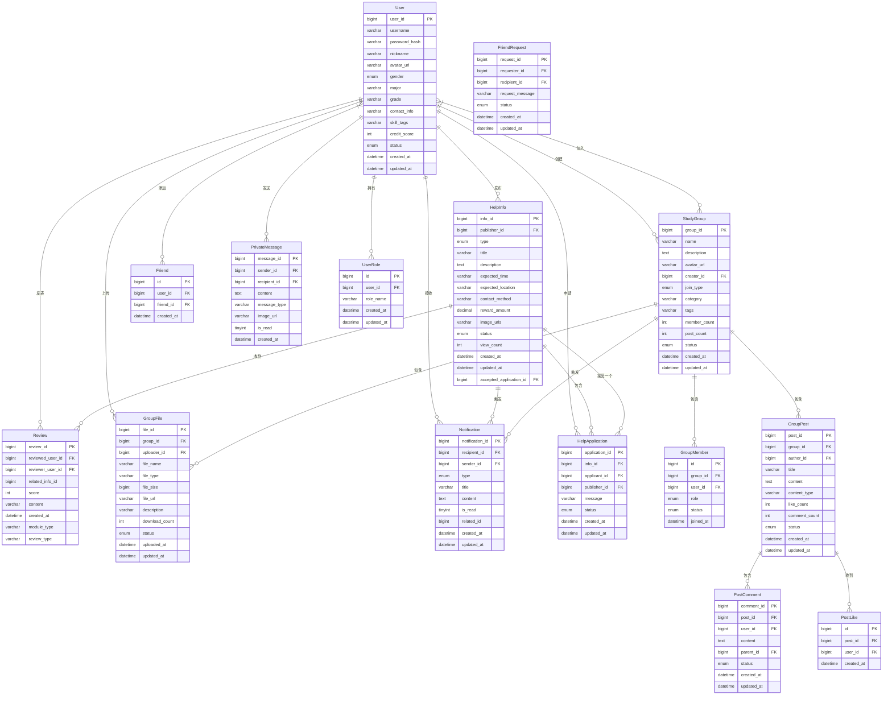

### 3.1.1 实体关系说明

1. **用户实体（User）**：
   - 系统的核心实体，存储用户基本信息
   - 与其他多个实体有关联关系
   - 包含身份验证信息、个人资料和信用评分

2. **互助信息实体（HelpInfo）**：
   - 记录用户发布的互助请求
   - 与发布者用户有多对一关系
   - 包含互助类型、标题、描述、期望时间地点等信息
   - 可接受一个互助申请

3. **互助申请实体（HelpApplication）**：
   - 记录用户对互助信息的申请
   - 与互助信息有多对一关系
   - 与申请者和发布者有多对一关系
   - 包含申请状态（待处理、已接受、已拒绝、已取消）

4. **学习小组实体（StudyGroup）**：
   - 记录学习小组基本信息
   - 与创建者有多对一关系
   - 包含名称、描述、分类、加入方式等信息
   - 有成员数量和帖子数量统计

5. **小组成员实体（GroupMember）**：
   - 记录用户与小组的关联关系
   - 包含角色信息（创建者、管理员、普通成员）
   - 包含状态信息（活跃、待批准、已禁止）

6. **小组帖子实体（GroupPost）**：
   - 记录小组内发布的帖子
   - 与小组和作者有多对一关系
   - 包含标题、内容、点赞数、评论数等信息

7. **帖子评论实体（PostComment）**：
   - 记录对帖子的评论
   - 与帖子和用户有多对一关系
   - 支持嵌套回复（通过parent_id）

8. **帖子点赞实体（PostLike）**：
   - 记录用户对帖子的点赞
   - 保证一个用户对一个帖子只能点赞一次

9. **好友关系实体（Friend）**：
   - 记录用户之间的好友关系
   - 包含创建时间信息

10. **好友申请实体（FriendRequest）**：
    - 记录用户之间的好友申请
    - 包含申请状态（待处理、已接受、已拒绝）

11. **私信实体（PrivateMessage）**：
    - 记录用户之间的私信内容
    - 包含消息类型（文本、图片、表情）
    - 包含已读状态和发送时间

12. **通知实体（Notification）**：
    - 记录系统向用户推送的通知
    - 包含多种通知类型（互助相关、小组相关、好友相关、系统通知等）
    - 包含已读状态和相关资源ID

13. **小组文件实体（GroupFile）**：
    - 记录小组内上传的文件
    - 与小组和上传者有多对一关系
    - 包含文件名、类型、大小、下载次数等信息

14. **评价实体（Review）**：
    - 记录用户对其他用户的评价
    - 包含评分和评价内容
    - 区分不同模块类型和评价类型

15. **用户角色实体（UserRole）**：
    - 记录用户的系统角色
    - 支持一个用户拥有多个角色

## 3.2 数据库设计

系统采用 MySQL 关系型数据库存储结构化数据，配合 Redis 缓存提高性能。

### 3.2.1 表结构设计

1. **用户表（user）**

| 字段名 | 数据类型 | 约束 | 说明 |
| ------ | -------- | ---- | ---- |
| user_id | bigint | PK, AUTO_INCREMENT | 用户ID |
| username | varchar(50) | NOT NULL, UNIQUE | 用户名/学号/邮箱 |
| password_hash | varchar(100) | NOT NULL | 加密密码 |
| nickname | varchar(50) | | 昵称 |
| avatar_url | varchar(255) | | 头像 |
| gender | enum('MALE', 'FEMALE', 'UNKNOWN') | DEFAULT 'UNKNOWN' | 性别 |
| major | varchar(100) | | 专业 |
| grade | varchar(20) | | 年级 |
| contact_info | varchar(255) | | 联系方式 |
| skill_tags | varchar(255) | | 技能标签(JSON字符串) |
| credit_score | int | DEFAULT 100 | 信用分 |
| status | enum('ACTIVE', 'INACTIVE', 'BANNED') | DEFAULT 'ACTIVE' | 状态 |
| created_at | datetime | DEFAULT CURRENT_TIMESTAMP | 创建时间 |
| updated_at | datetime | DEFAULT CURRENT_TIMESTAMP ON UPDATE CURRENT_TIMESTAMP | 更新时间 |

2. **互助信息表（help_info）**

| 字段名 | 数据类型 | 约束 | 说明 |
| ------ | -------- | ---- | ---- |
| info_id | bigint | PK, AUTO_INCREMENT | 信息ID |
| publisher_id | bigint | NOT NULL, FK | 发布用户ID |
| type | enum('COURSE_TUTORING', 'SKILL_LEARNING', 'ITEM_LEND', 'ITEM_EXCHANGE', 'TEAM_UP') | NOT NULL | 互助类型 |
| title | varchar(100) | NOT NULL | 标题 |
| description | text | | 描述 |
| expected_time | varchar(100) | | 期望时间 |
| expected_location | varchar(100) | | 期望地点 |
| contact_method | varchar(100) | | 联系方式 |
| reward_amount | decimal(10, 2) | | 悬赏金额 |
| image_urls | varchar(500) | | 图片链接(JSON) |
| status | enum('OPEN', 'IN_PROGRESS', 'RESOLVED', 'EXPIRED', 'CLOSED') | DEFAULT 'OPEN' | 状态 |
| view_count | int | DEFAULT 0 | 浏览次数 |
| accepted_application_id | bigint | | 已接受的申请ID |
| created_at | datetime | DEFAULT CURRENT_TIMESTAMP | 创建时间 |
| updated_at | datetime | DEFAULT CURRENT_TIMESTAMP ON UPDATE CURRENT_TIMESTAMP | 更新时间 |

3. **互助申请表（help_application）**

| 字段名 | 数据类型 | 约束 | 说明 |
| ------ | -------- | ---- | ---- |
| application_id | bigint | PK, AUTO_INCREMENT | 申请ID |
| info_id | bigint | NOT NULL, FK | 互助信息ID |
| applicant_id | bigint | NOT NULL, FK | 申请用户ID |
| publisher_id | bigint | NOT NULL, FK | 信息发布者ID |
| message | varchar(255) | | 申请附言 |
| status | enum('PENDING', 'ACCEPTED', 'REJECTED', 'CANCELED') | DEFAULT 'PENDING' | 状态 |
| created_at | datetime | DEFAULT CURRENT_TIMESTAMP | 创建时间 |
| updated_at | datetime | DEFAULT CURRENT_TIMESTAMP ON UPDATE CURRENT_TIMESTAMP | 更新时间 |

4. **学习小组表（study_group）**

| 字段名 | 数据类型 | 约束 | 说明 |
| ------ | -------- | ---- | ---- |
| group_id | bigint | PK, AUTO_INCREMENT | 小组ID |
| name | varchar(100) | NOT NULL | 小组名称 |
| description | text | | 小组描述 |
| avatar_url | varchar(255) | | 小组头像URL |
| creator_id | bigint | NOT NULL, FK | 创建者ID |
| join_type | enum('PUBLIC', 'APPROVAL') | DEFAULT 'PUBLIC' | 加入方式 |
| category | varchar(50) | | 小组分类 |
| tags | varchar(255) | | 小组标签(JSON数组字符串) |
| member_count | int | DEFAULT 0 | 成员数量 |
| post_count | int | DEFAULT 0 | 帖子数量 |
| status | enum('ACTIVE', 'INACTIVE', 'DISBANDED') | DEFAULT 'ACTIVE' | 小组状态 |
| created_at | datetime | DEFAULT CURRENT_TIMESTAMP | 创建时间 |
| updated_at | datetime | DEFAULT CURRENT_TIMESTAMP ON UPDATE CURRENT_TIMESTAMP | 更新时间 |

5. **小组成员表（group_member）**

| 字段名 | 数据类型 | 约束 | 说明 |
| ------ | -------- | ---- | ---- |
| id | bigint | PK, AUTO_INCREMENT | ID |
| group_id | bigint | NOT NULL, FK | 小组ID |
| user_id | bigint | NOT NULL, FK | 用户ID |
| role | enum('MEMBER', 'ADMIN', 'CREATOR') | DEFAULT 'MEMBER' | 角色 |
| status | enum('ACTIVE', 'PENDING_APPROVAL', 'BANNED') | DEFAULT 'ACTIVE' | 状态 |
| joined_at | datetime | DEFAULT CURRENT_TIMESTAMP | 加入时间 |

6. **小组帖子表（group_post）**

| 字段名 | 数据类型 | 约束 | 说明 |
| ------ | -------- | ---- | ---- |
| post_id | bigint | PK, AUTO_INCREMENT | 帖子ID |
| group_id | bigint | NOT NULL, FK | 小组ID |
| author_id | bigint | NOT NULL, FK | 作者ID |
| title | varchar(100) | NOT NULL | 帖子标题 |
| content | text | | 帖子内容 |
| content_type | varchar(20) | DEFAULT 'TEXT' | 内容类型 |
| like_count | int | DEFAULT 0 | 点赞数量 |
| comment_count | int | DEFAULT 0 | 评论数量 |
| status | enum('PUBLISHED', 'DELETED') | DEFAULT 'PUBLISHED' | 状态 |
| created_at | datetime | DEFAULT CURRENT_TIMESTAMP | 创建时间 |
| updated_at | datetime | DEFAULT CURRENT_TIMESTAMP ON UPDATE CURRENT_TIMESTAMP | 更新时间 |

7. **帖子评论表（post_comment）**

| 字段名 | 数据类型 | 约束 | 说明 |
| ------ | -------- | ---- | ---- |
| comment_id | bigint | PK, AUTO_INCREMENT | 评论ID |
| post_id | bigint | NOT NULL, FK | 帖子ID |
| user_id | bigint | NOT NULL, FK | 用户ID |
| content | text | NOT NULL | 评论内容 |
| parent_id | bigint | FK | 父评论ID，用于回复 |
| status | enum('PUBLISHED', 'DELETED') | DEFAULT 'PUBLISHED' | 状态 |
| created_at | datetime | DEFAULT CURRENT_TIMESTAMP | 创建时间 |
| updated_at | datetime | DEFAULT CURRENT_TIMESTAMP ON UPDATE CURRENT_TIMESTAMP | 更新时间 |

8. **帖子点赞表（post_like）**

| 字段名 | 数据类型 | 约束 | 说明 |
| ------ | -------- | ---- | ---- |
| id | bigint | PK, AUTO_INCREMENT | ID |
| post_id | bigint | NOT NULL, FK | 帖子ID |
| user_id | bigint | NOT NULL, FK | 用户ID |
| created_at | datetime | DEFAULT CURRENT_TIMESTAMP | 点赞时间 |

9. **小组文件表（group_file）**

| 字段名 | 数据类型 | 约束 | 说明 |
| ------ | -------- | ---- | ---- |
| file_id | bigint | PK, AUTO_INCREMENT | 文件ID |
| group_id | bigint | NOT NULL, FK | 小组ID |
| uploader_id | bigint | NOT NULL, FK | 上传者ID |
| file_name | varchar(255) | NOT NULL | 文件名 |
| file_type | varchar(20) | | 文件类型 |
| file_size | bigint | | 文件大小(字节) |
| file_url | varchar(255) | | 文件存储路径 |
| description | varchar(255) | | 文件描述 |
| download_count | int | DEFAULT 0 | 下载次数 |
| status | enum('AVAILABLE', 'DELETED') | DEFAULT 'AVAILABLE' | 状态 |
| uploaded_at | datetime | DEFAULT CURRENT_TIMESTAMP | 上传时间 |
| updated_at | datetime | DEFAULT CURRENT_TIMESTAMP ON UPDATE CURRENT_TIMESTAMP | 更新时间 |

10. **通知表（notification）**

| 字段名 | 数据类型 | 约束 | 说明 |
| ------ | -------- | ---- | ---- |
| notification_id | bigint | PK, AUTO_INCREMENT | 通知ID |
| recipient_id | bigint | NOT NULL, FK | 接收者用户ID |
| sender_id | bigint | FK | 发送者用户ID（系统通知可为null） |
| type | enum多种类型 | NOT NULL | 通知类型 |
| title | varchar(100) | NOT NULL | 通知标题 |
| content | text | | 通知内容 |
| is_read | tinyint(1) | DEFAULT 0 | 是否已读 |
| related_id | bigint | | 相关ID（如互助ID、小组ID等） |
| created_at | datetime | DEFAULT CURRENT_TIMESTAMP | 创建时间 |
| updated_at | datetime | DEFAULT CURRENT_TIMESTAMP ON UPDATE CURRENT_TIMESTAMP | 更新时间 |

11. **私信表（private_message）**

| 字段名 | 数据类型 | 约束 | 说明 |
| ------ | -------- | ---- | ---- |
| message_id | bigint | PK, AUTO_INCREMENT | 消息ID |
| sender_id | bigint | NOT NULL, FK | 发送者用户ID |
| recipient_id | bigint | NOT NULL, FK | 接收者用户ID |
| content | text | NOT NULL | 消息内容 |
| message_type | varchar(20) | DEFAULT 'TEXT' | 消息类型: TEXT, IMAGE, EMOJI |
| image_url | varchar(500) | | 图片URL（当messageType为IMAGE时使用） |
| is_read | tinyint(1) | DEFAULT 0 | 是否已读 |
| created_at | datetime | DEFAULT CURRENT_TIMESTAMP | 创建时间 |

12. **好友关系表（friend）**

| 字段名 | 数据类型 | 约束 | 说明 |
| ------ | -------- | ---- | ---- |
| id | bigint | PK, AUTO_INCREMENT | 关系ID |
| user_id | bigint | NOT NULL, FK | 用户ID |
| friend_id | bigint | NOT NULL, FK | 好友ID |
| created_at | datetime | DEFAULT CURRENT_TIMESTAMP | 创建时间 |

13. **好友申请表（friend_request）**

| 字段名 | 数据类型 | 约束 | 说明 |
| ------ | -------- | ---- | ---- |
| request_id | bigint | PK, AUTO_INCREMENT | 申请ID |
| requester_id | bigint | NOT NULL, FK | 申请者ID |
| recipient_id | bigint | NOT NULL, FK | 接收者ID |
| request_message | varchar(255) | | 申请消息 |
| status | enum('PENDING', 'ACCEPTED', 'REJECTED') | DEFAULT 'PENDING' | 申请状态 |
| created_at | datetime | DEFAULT CURRENT_TIMESTAMP | 创建时间 |
| updated_at | datetime | DEFAULT CURRENT_TIMESTAMP ON UPDATE CURRENT_TIMESTAMP | 更新时间 |

14. **评价表（review）**

| 字段名 | 数据类型 | 约束 | 说明 |
| ------ | -------- | ---- | ---- |
| review_id | bigint | PK, AUTO_INCREMENT | 评价ID |
| reviewed_user_id | bigint | NOT NULL, FK | 被评用户ID |
| reviewer_user_id | bigint | NOT NULL, FK | 评价用户ID |
| related_info_id | bigint | | 关联信息ID |
| score | int | NOT NULL | 评分 |
| content | varchar(255) | | 评价内容 |
| created_at | datetime | DEFAULT CURRENT_TIMESTAMP | 创建时间 |
| module_type | varchar(32) | | 所属模块类型（如HELP、GROUP等） |
| review_type | varchar(32) | | 评价类型：PUBLISHER_TO_HELPER(发布者评价帮助者), HELPER_TO_PUBLISHER(帮助者评价发布者) |

15. **用户角色表（user_role）**

| 字段名 | 数据类型 | 约束 | 说明 |
| ------ | -------- | ---- | ---- |
| id | bigint | PK, AUTO_INCREMENT | 主键ID |
| user_id | bigint | NOT NULL | 用户ID |
| role_name | varchar(50) | NOT NULL | 角色名称 |
| created_at | datetime | | 创建时间 |
| updated_at | datetime | | 更新时间 |

### 3.2.2 索引设计

系统在关键字段上建立了索引，提高查询性能：

1. **主键索引**：所有表的主键字段都建立了主键索引
2. **外键索引**：外键关联字段自动创建索引，如 user_id、group_id 等
3. **唯一索引**：
   - user表的username字段（用户名唯一）
   - friend表的(user_id, friend_id)组合（好友关系唯一）
   - group_member表的(group_id, user_id)组合（小组成员唯一）
   - post_like表的(post_id, user_id)组合（用户对帖子的点赞唯一）
   - user_role表的(user_id, role_name)组合（用户角色唯一）
4. **普通索引**：
   - private_message表的created_at字段（按时间查询消息）
   - private_message表的message_type字段（按消息类型查询）
   - friend_request表的requester_id和recipient_id字段（查询发出的和收到的好友请求）

### 3.2.3 表关联关系

1. **用户相关**：
   - user表是核心表，与其他多个表有外键关联
   - user_role表通过user_id与user表关联，定义用户角色

2. **互助信息相关**：
   - help_info表通过publisher_id与user表关联
   - help_application表通过info_id与help_info表关联，通过applicant_id和publisher_id与user表关联
   - help_info表通过accepted_application_id与help_application表关联

3. **学习小组相关**：
   - study_group表通过creator_id与user表关联
   - group_member表通过group_id与study_group表关联，通过user_id与user表关联
   - group_post表通过group_id与study_group表关联，通过author_id与user表关联
   - group_file表通过group_id与study_group表关联，通过uploader_id与user表关联
   - post_comment表通过post_id与group_post表关联，通过user_id与user表关联
   - post_like表通过post_id与group_post表关联，通过user_id与user表关联

4. **社交相关**：
   - friend表通过user_id和friend_id与user表关联
   - friend_request表通过requester_id和recipient_id与user表关联
   - private_message表通过sender_id和recipient_id与user表关联
   - notification表通过recipient_id和sender_id与user表关联

5. **评价相关**：
   - review表通过reviewed_user_id和reviewer_user_id与user表关联

### 3.2.2 索引设计

为提高查询性能，系统在以下字段上建立了索引：

1. **主键索引**：所有表的id字段
2. **外键索引**：如user_id, help_info_id, group_id等
3. **唯一索引**：用户名、邮箱等需要唯一性的字段
4. **组合索引**：用于常见的查询场景，如(user_id, status)组合索引用于快速查询用户的特定状态互助信息

### 3.2.3 数据库事务设计

对于涉及多表操作的业务场景，使用事务确保数据一致性：

1. **互助信息状态变更**：同时更新互助信息状态和相关通知
2. **小组成员管理**：添加或删除小组成员同时更新小组成员数量统计
3. **用户评价处理**：提交评价同时更新用户信用评分

## 3.3 数据安全策略

### 3.3.1 数据加密

1. **存储加密**：
   - 用户密码使用BCrypt算法加密存储
   - 敏感个人信息使用AES加密

2. **传输加密**：
   - 使用HTTPS协议加密传输
   - WebSocket连接使用WSS加密

### 3.3.2 数据备份

1. **定时备份策略**：
   - 每日凌晨进行全量备份
   - 每4小时进行增量备份
   - 备份文件保留策略：全量备份保留30天，增量备份保留7天

2. **备份恢复机制**：
   - 支持按时间点恢复
   - 支持数据库级别、表级别恢复

### 3.3.3 数据访问控制

1. **权限隔离**：
   - 按角色分配数据访问权限
   - 用户只能访问自己有权限的数据

2. **操作审计**：
   - 记录敏感数据的访问和修改操作
   - 定期审计数据操作日志

# 4. 核心功能模块设计

## 4.1 用户管理模块

用户管理模块负责用户的注册、登录、个人资料管理等功能，是系统的基础模块。

### 4.1.1 功能结构

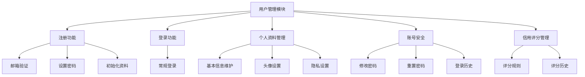

### 4.1.2 核心接口设计

1. **用户注册接口**
   ```
   POST /api/auth/register
   
   请求参数：
   {
     "username": "string", // 用户名
     "email": "string",    // 邮箱
     "password": "string", // 密码
     "nickname": "string"  // 昵称
   }
   
   响应结果：
   {
     "code": 200,
     "message": "string",
     "data": {
       "userId": "long",
       "username": "string",
       "email": "string",
       "nickname": "string"
     }
   }
   ```

2. **用户登录接口**
   ```
   POST /api/auth/login
   
   请求参数：
   {
     "username": "string", // 用户名或邮箱
     "password": "string"  // 密码
   }
   
   响应结果：
   {
     "code": 200,
     "message": "string",
     "data": {
       "token": "string",  // JWT令牌
       "userId": "long",
       "username": "string",
       "nickname": "string",
       "avatar": "string",
       "roles": ["string"]
     }
   }
   ```

3. **个人资料更新接口**
   ```
   PUT /api/user/profile
   
   请求参数：
   {
     "nickname": "string",
     "avatar": "string",
     "school": "string",
     "major": "string",
     "biography": "string"
   }
   
   响应结果：
   {
     "code": 200,
     "message": "string",
     "data": {
       "userId": "long",
       "nickname": "string",
       "avatar": "string",
       "school": "string",
       "major": "string",
       "biography": "string",
       "updateTime": "date"
     }
   }
   ```

### 4.1.3 安全设计

1. **密码策略**：
   - 最小长度8个字符
   - 必须包含大小写字母、数字和特殊字符
   - 定期提醒修改密码

2. **账号保护**：
   - 登录失败超过5次锁定账号10分钟
   - 异地登录邮件提醒
   - 支持两因素认证

3. **隐私保护**：
   - 支持控制个人信息对外可见范围
   - 支持设置消息接收范围

## 4.2 互助信息模块

互助信息模块是平台的核心业务功能，负责互助信息的发布、查询、响应和管理。

### 4.2.1 状态转换图

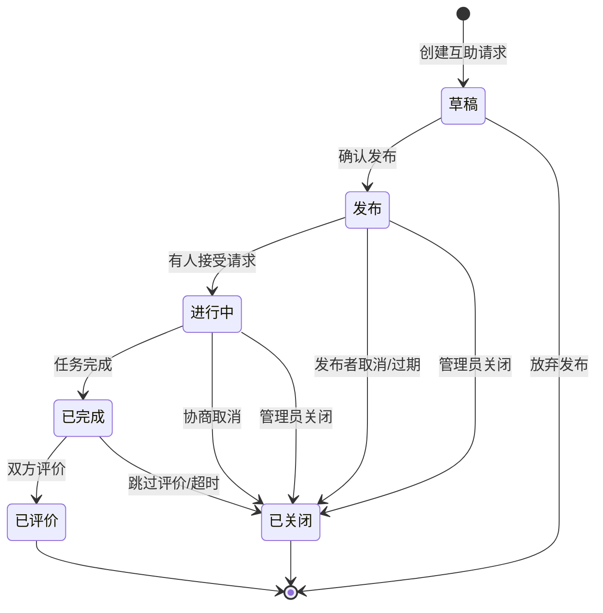

### 4.2.2 功能结构

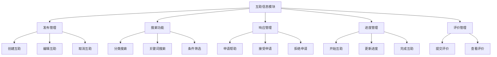

### 4.2.3 核心接口设计

1. **发布互助信息接口**
   ```
   POST /api/helpinfo
   
   请求参数：
   {
     "title": "string",
     "content": "string",
     "category": "string",
     "urgencyLevel": int,
     "deadlineTime": "date"
   }
   
   响应结果：
   {
     "code": 200,
     "message": "string",
     "data": {
       "id": "long",
       "title": "string",
       "content": "string",
       "category": "string",
       "urgencyLevel": int,
       "deadlineTime": "date",
       "status": int,
       "createTime": "date"
     }
   }
   ```

2. **申请互助接口**
   ```
   POST /api/helpinfo/{id}/apply
   
   请求参数：
   {
     "message": "string" // 申请留言
   }
   
   响应结果：
   {
     "code": 200,
     "message": "string",
     "data": {
       "applicationId": "long",
       "helpInfoId": "long",
       "applicantId": "long",
       "status": int,
       "createTime": "date"
     }
   }
   ```

3. **完成互助接口**
   ```
   PUT /api/helpinfo/{id}/complete
   
   请求参数：
   {
     "completeMessage": "string" // 完成说明
   }
   
   响应结果：
   {
     "code": 200,
     "message": "string",
     "data": {
       "id": "long",
       "title": "string",
       "status": int,
       "updateTime": "date"
     }
   }
   ```

### 4.2.4 业务规则

1. **发布规则**：
   - 每个用户每天最多发布10条互助信息
   - 互助信息标题长度5-50个字符
   - 互助信息内容长度10-5000个字符

2. **申请规则**：
   - 信用评分低于60分的用户不能申请互助
   - 每个互助信息最多接受10个申请
   - 用户不能申请自己发布的互助

3. **评价规则**：
   - 互助完成后7天内可以评价
   - 评价分为1-5星
   - 评价内容长度不超过500个字符

## 4.3 学习小组模块

学习小组模块提供小组创建、管理、交流等功能，支持用户组织学习活动。

### 4.3.1 状态转换图

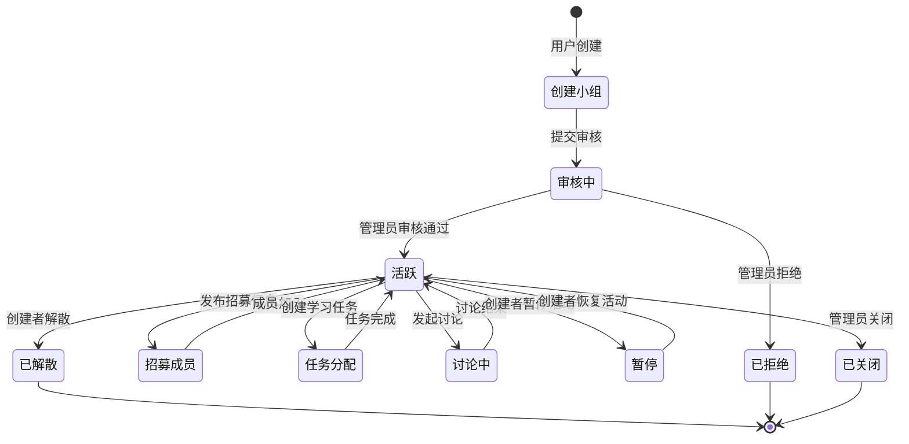

### 4.3.2 功能结构

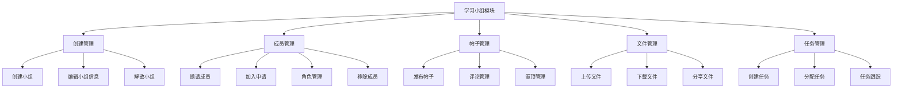

### 4.3.3 核心接口设计

1. **创建学习小组接口**
   ```
   POST /api/group
   
   请求参数：
   {
     "name": "string",
     "description": "string",
     "category": "string",
     "avatar": "string",
     "memberLimit": int
   }
   
   响应结果：
   {
     "code": 200,
     "message": "string",
     "data": {
       "id": "long",
       "name": "string",
       "description": "string",
       "category": "string",
       "avatar": "string",
       "memberLimit": int,
       "creatorId": "long",
       "status": int,
       "createTime": "date"
     }
   }
   ```

2. **加入学习小组接口**
   ```
   POST /api/group/{id}/join
   
   请求参数：
   {
     "message": "string" // 加入申请留言
   }
   
   响应结果：
   {
     "code": 200,
     "message": "string",
     "data": {
       "applicationId": "long",
       "groupId": "long",
       "userId": "long",
       "status": int,
       "createTime": "date"
     }
   }
   ```

3. **发布小组帖子接口**
   ```
   POST /api/group/{id}/post
   
   请求参数：
   {
     "title": "string",
     "content": "string",
     "attachments": ["string"] // 附件ID列表
   }
   
   响应结果：
   {
     "code": 200,
     "message": "string",
     "data": {
       "id": "long",
       "groupId": "long",
       "title": "string",
       "content": "string",
       "attachments": [
         {
           "id": "long",
           "filename": "string",
           "fileType": "string",
           "fileSize": "long"
         }
       ],
       "authorId": "long",
       "authorName": "string",
       "createTime": "date"
     }
   }
   ```

### 4.3.4 业务规则

1. **小组创建规则**：
   - 每个用户最多创建5个小组
   - 小组名称长度3-30个字符
   - 小组成员上限最大200人

2. **成员管理规则**：
   - 小组创建者拥有最高权限
   - 支持设置小组管理员
   - 成员可以自由退出，管理员可以移除成员

3. **内容管理规则**：
   - 支持Markdown格式帖子
   - 单个文件上传大小限制50MB
   - 小组总存储空间限制10GB

## 4.4 好友系统模块

好友系统模块提供用户间建立社交关系的功能，支持好友添加、管理等操作。

### 4.4.1 功能流程图

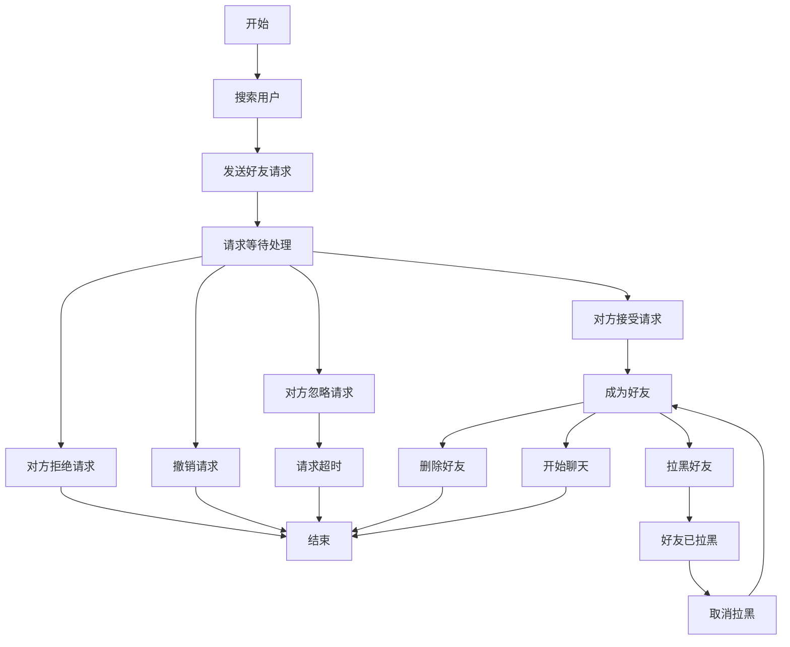

### 4.4.2 功能结构

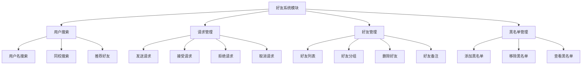

### 4.4.3 核心接口设计

1. **发送好友请求接口**
   ```
   POST /api/friend/request
   
   请求参数：
   {
     "targetUserId": "long",
     "message": "string" // 附加消息
   }
   
   响应结果：
   {
     "code": 200,
     "message": "string",
     "data": {
       "id": "long",
       "fromUserId": "long",
       "toUserId": "long",
       "status": int,
       "createTime": "date"
     }
   }
   ```

2. **处理好友请求接口**
   ```
   PUT /api/friend/request/{id}
   
   请求参数：
   {
     "action": "string", // accept/reject
     "message": "string" // 回复消息
   }
   
   响应结果：
   {
     "code": 200,
     "message": "string",
     "data": {
       "id": "long",
       "fromUserId": "long",
       "toUserId": "long",
       "status": int,
       "updateTime": "date"
     }
   }
   ```

3. **获取好友列表接口**
   ```
   GET /api/friend/list
   
   请求参数：
   {
     "keyword": "string", // 可选，搜索关键字
     "pageNum": int,
     "pageSize": int
   }
   
   响应结果：
   {
     "code": 200,
     "message": "string",
     "data": {
       "total": "long",
       "list": [
         {
           "userId": "long",
           "username": "string",
           "nickname": "string",
           "avatar": "string",
           "remark": "string",
           "online": boolean,
           "lastActiveTime": "date"
         }
       ]
     }
   }
   ```

### 4.4.4 业务规则

1. **添加规则**：
   - 每天最多发送50个好友请求
   - 好友请求7天内未处理自动过期
   - 不能添加已在黑名单中的用户

2. **管理规则**：
   - 好友上限500人
   - 黑名单上限200人
   - 支持按分组管理好友

## 4.5 即时通讯模块

即时通讯模块提供用户间实时消息交流的功能，支持私聊等通信方式。

### 4.5.1 功能流程图

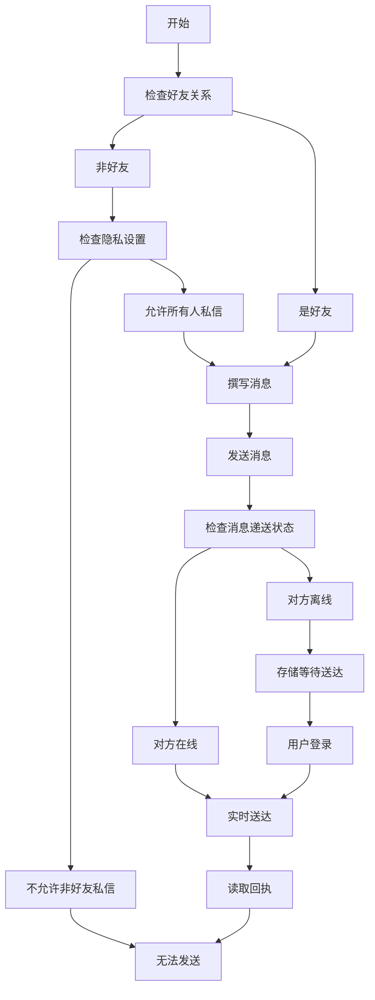

### 4.5.2 功能结构

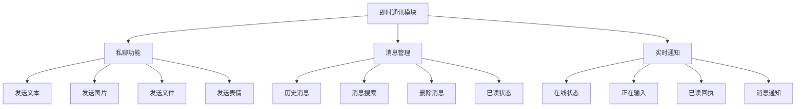

### 4.5.3 WebSocket通信流程

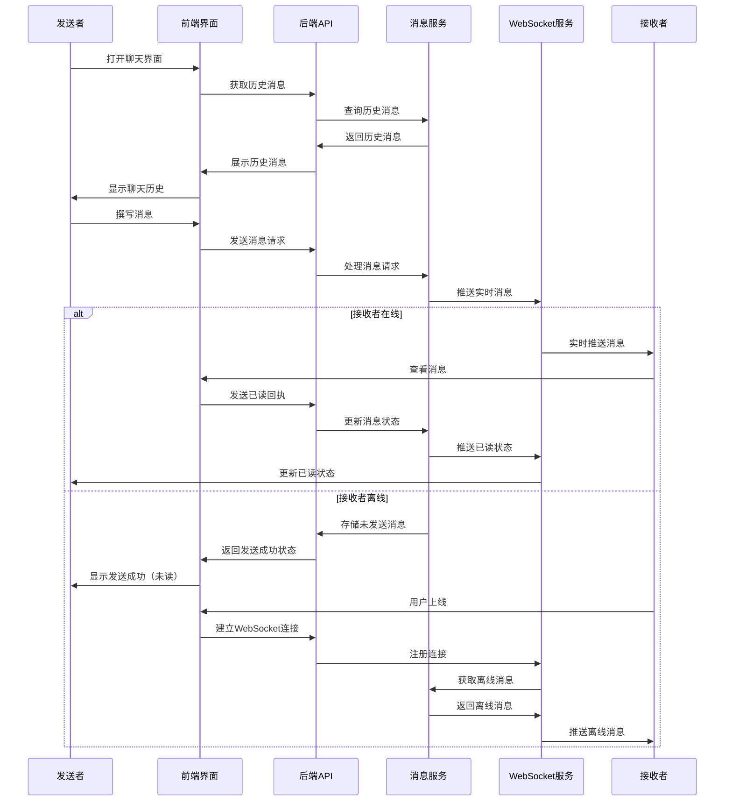

### 4.5.4 核心接口设计

1. **发送私聊消息接口**
   ```
   POST /api/message
   
   请求参数：
   {
     "receiverId": "long",
     "content": "string",
     "messageType": int // 0-文本,1-图片,2-文件,3-表情
   }
   
   响应结果：
   {
     "code": 200,
     "message": "string",
     "data": {
       "id": "long",
       "senderId": "long",
       "receiverId": "long",
       "content": "string",
       "messageType": int,
       "status": int,
       "sendTime": "date"
     }
   }
   ```

2. **获取聊天历史接口**
   ```
   GET /api/message/history/{userId}
   
   请求参数：
   {
     "pageSize": int,
     "lastMessageId": "long" // 上次加载的最后一条消息ID
   }
   
   响应结果：
   {
     "code": 200,
     "message": "string",
     "data": {
       "hasMore": boolean,
       "messages": [
         {
           "id": "long",
           "senderId": "long",
           "receiverId": "long",
           "content": "string",
           "messageType": int,
           "status": int,
           "sendTime": "date",
           "readTime": "date"
         }
       ]
     }
   }
   ```

3. **WebSocket消息格式**
   ```
   // 客户端发送消息
   {
     "type": "CHAT_MESSAGE",
     "data": {
       "receiverId": "long",
       "content": "string",
       "messageType": int
     }
   }
   
   // 服务端推送消息
   {
     "type": "CHAT_MESSAGE",
     "data": {
       "id": "long",
       "senderId": "long",
       "senderName": "string",
       "senderAvatar": "string",
       "content": "string",
       "messageType": int,
       "sendTime": "date"
     }
   }
   
   // 已读回执
   {
     "type": "READ_RECEIPT",
     "data": {
       "userId": "long",
       "messageIds": ["long"]
     }
   }
   ```

### 4.5.5 业务规则

1. **消息限制**：
   - 文本消息最大长度5000字符
   - 图片最大5MB
   - 文件最大50MB
   - 非好友每天最多发送10条消息

2. **存储策略**：
   - 消息默认保存180天
   - 支持手动删除消息（仅本地删除）
   - 敏感内容自动过滤

## 4.6 通知系统模块

通知系统模块负责向用户推送各类系统和业务通知，支持实时推送和历史查询。

### 4.6.1 功能结构

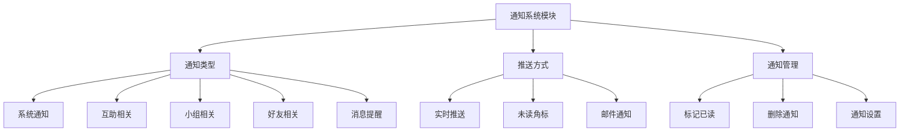

### 4.6.2 核心接口设计

1. **获取通知列表接口**
   ```
   GET /api/notification/list
   
   请求参数：
   {
     "type": int, // 可选，通知类型
     "pageNum": int,
     "pageSize": int
   }
   
   响应结果：
   {
     "code": 200,
     "message": "string",
     "data": {
       "total": "long",
       "unreadCount": int,
       "list": [
         {
           "id": "long",
           "title": "string",
           "content": "string",
           "sourceType": int,
           "sourceId": "long",
           "status": int,
           "createTime": "date",
           "readTime": "date"
         }
       ]
     }
   }
   ```

2. **标记通知已读接口**
   ```
   PUT /api/notification/read
   
   请求参数：
   {
     "notificationIds": ["long"] // 通知ID列表，为空表示全部已读
   }
   
   响应结果：
   {
     "code": 200,
     "message": "string",
     "data": {
       "readCount": int
     }
   }
   ```

3. **WebSocket通知推送格式**
   ```
   // 服务端推送通知
   {
     "type": "NOTIFICATION",
     "data": {
       "id": "long",
       "title": "string",
       "content": "string",
       "sourceType": int,
       "sourceId": "long",
       "createTime": "date"
     }
   }
   ```

### 4.6.3 业务规则

1. **通知分类**：
   - 系统通知：系统维护、账号安全等
   - 互助通知：申请响应、状态变更等
   - 小组通知：成员变动、帖子回复等
   - 好友通知：好友申请、好友动态等
   - 消息通知：新消息提醒

2. **通知策略**：
   - 重要通知同时通过WebSocket和邮件推送
   - 普通通知仅通过WebSocket推送
   - 支持用户自定义通知接收设置

## 4.7 文件管理模块

文件管理模块提供文件上传、下载、分享等功能，支持用户和小组文件管理。

### 4.7.1 功能结构

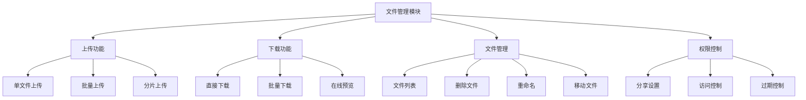

### 4.7.2 核心接口设计

1. **文件上传接口**
   ```
   POST /api/file/upload
   Content-Type: multipart/form-data
   
   请求参数：
   {
     "file": File,
     "relatedType": int, // 0-个人,1-互助,2-小组,3-聊天
     "relatedId": "long" // 关联ID
   }
   
   响应结果：
   {
     "code": 200,
     "message": "string",
     "data": {
       "id": "long",
       "filename": "string",
       "originalFilename": "string",
       "filePath": "string",
       "fileType": "string",
       "fileSize": "long",
       "uploadTime": "date"
     }
   }
   ```

2. **文件下载接口**
   ```
   GET /api/file/download/{fileId}
   
   响应：
   文件二进制流
   ```

3. **文件列表接口**
   ```
   GET /api/file/list
   
   请求参数：
   {
     "relatedType": int, // 可选
     "relatedId": "long", // 可选
     "pageNum": int,
     "pageSize": int
   }
   
   响应结果：
   {
     "code": 200,
     "message": "string",
     "data": {
       "total": "long",
       "list": [
         {
           "id": "long",
           "filename": "string",
           "originalFilename": "string",
           "fileType": "string",
           "fileSize": "long",
           "uploadTime": "date"
         }
       ]
     }
   }
   ```

### 4.7.3 业务规则

1. **上传限制**：
   - 单文件大小限制：普通用户50MB，VIP用户200MB
   - 存储空间限制：普通用户5GB，VIP用户50GB
   - 支持的文件类型：文档、图片、音频、视频等常见格式

2. **安全控制**：
   - 文件扫描：上传前检测恶意代码
   - 文件加密：敏感文件加密存储
   - 访问权限：基于用户角色和关联关系控制

## 4.8 评价系统模块

评价系统模块提供用户互助后的评价功能，是用户信用体系的重要组成部分。

### 4.8.1 功能结构

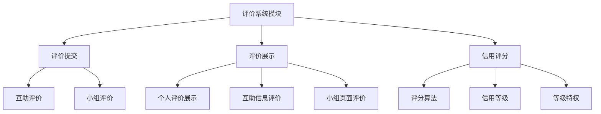

### 4.8.2 核心接口设计

1. **提交评价接口**
   ```
   POST /api/review
   
   请求参数：
   {
     "targetType": int, // 0-互助,1-小组
     "targetId": "long",
     "rating": int, // 1-5分
     "content": "string" // 评价内容
   }
   
   响应结果：
   {
     "code": 200,
     "message": "string",
     "data": {
       "id": "long",
       "targetType": int,
       "targetId": "long",
       "rating": int,
       "content": "string",
       "createTime": "date"
     }
   }
   ```

2. **获取用户评价接口**
   ```
   GET /api/review/user/{userId}
   
   请求参数：
   {
     "pageNum": int,
     "pageSize": int
   }
   
   响应结果：
   {
     "code": 200,
     "message": "string",
     "data": {
       "total": "long",
       "averageRating": float,
       "list": [
         {
           "id": "long",
           "targetType": int,
           "targetId": "long",
           "targetTitle": "string",
           "rating": int,
           "content": "string",
           "reviewerName": "string",
           "reviewerAvatar": "string",
           "createTime": "date"
         }
       ]
     }
   }
   ```

### 4.8.3 业务规则

1. **评价规则**：
   - 互助完成后双方互评
   - 评分范围1-5星
   - 评价一旦提交不可修改，但可追加评论

2. **信用评分规则**：
   - 初始信用分100分
   - 收到5星好评+3分
   - 收到1星差评-5分
   - 被投诉确认有效-10分
   - 信用分范围0-150分

# 5. 系统流程设计

## 5.1 互助功能流程

互助功能是平台的核心业务流程，从发布到完成的全流程设计确保了互助行为的顺畅进行。

### 5.1.1 互助功能顺序图

```mermaid
sequenceDiagram
    actor User as 用户
    participant UI as 前端
    participant API as 后端API
    participant DB as 数据库
    
    %% 互助信息发布与浏览
    User->>UI: 浏览/搜索互助信息
    UI->>API: 获取互助信息列表
    API->>DB: 查询数据
    DB-->>API: 返回结果
    API-->>UI: 展示互助信息
    
    User->>UI: 发布互助信息
    UI->>API: 提交互助信息
    API->>DB: 保存数据
    DB-->>API: 保存成功
    API-->>UI: 返回结果
    
    %% 申请与处理
    User->>UI: 申请互助
    UI->>API: 提交互助申请
    API->>DB: 创建申请记录
    API-->>UI: 申请已提交
    
    User->>UI: 查看/处理申请
    UI->>API: 获取申请列表
    API->>DB: 查询申请
    DB-->>API: 返回申请列表
    API-->>UI: 显示申请列表
    
    User->>UI: 接受申请
    UI->>API: 更新申请状态
    API->>DB: 更新互助状态为进行中
    DB-->>API: 更新成功
    API-->>UI: 显示已接受
    
    %% 互助执行与完成
    User->>UI: 标记互助完成
    UI->>API: 更新互助状态
    API->>DB: 修改状态为已完成
    DB-->>API: 更新成功
    API-->>UI: 显示已完成
    
    %% 互助评价
    User->>UI: 提交互助评价
    UI->>API: 发送评价信息
    API->>DB: 保存评价数据
    API->>DB: 更新用户信用分
    DB-->>API: 保存成功
    API-->>UI: 评价成功
    UI-->>User: 显示评价结果
```

### 5.1.2 互助功能流程说明

1. **发布阶段**：
   - 请求者填写互助信息表单
   - 系统验证信息有效性
   - 互助信息发布成功
   - 可在互助信息列表中展示

2. **响应阶段**：
   - 接受者浏览互助信息列表
   - 接受者申请接受特定互助请求
   - 系统通知请求者有新申请
   - 请求者确认接受申请
   - 互助状态变更为进行中

3. **执行阶段**：
   - 双方线上或线下进行互助
   - 系统提供沟通工具
   - 请求者可跟踪进度
   - 遇到问题可寻求管理员协助

4. **完成阶段**：
   - 请求者标记互助完成
   - 系统通知接受者互助已完成

5. **评价阶段**：
   - 双方互相评价对方
   - 系统根据评价更新信用分
   - 评价内容对其他用户可见
   - 互助流程完全结束

### 5.1.3 关键业务规则

1. **互助时限控制**：
   - 互助请求默认有效期7天
   - 进行中状态超过15天自动提醒
   - 进行中状态超过30天系统介入

2. **互助取消规则**：
   - 未确认前请求者可随时取消
   - 进行中状态需双方同意才能取消
   - 无故取消将影响信用评分

3. **争议处理机制**：
   - 提供举报功能
   - 支持上传证据
   - 管理员介入调解
   - 严重违规封禁账号

## 5.2 学习小组流程

学习小组功能支持用户组建学习团体，从创建到管理的全流程设计。

### 5.2.1 学习小组顺序图

```mermaid
sequenceDiagram
    actor User as 用户
    participant UI as 前端
    participant API as 后端API
    participant DB as 数据库
    
    %% 小组基本管理
    User->>UI: 创建/搜索学习小组
    UI->>API: 提交小组信息/查询小组
    API->>DB: 保存/查询数据
    DB-->>API: 返回结果
    API-->>UI: 显示小组信息
    
    %% 成员管理部分
    rect rgb(230, 230, 250)
    Note over User, DB: 成员管理
    User->>UI: 申请加入小组
    UI->>API: 提交加入申请
    API->>DB: 创建申请记录
    API-->>UI: 申请已提交
    
    User->>UI: 管理成员(管理员)
    UI->>API: 获取成员/申请列表
    API->>DB: 查询数据
    DB-->>API: 返回数据
    API-->>UI: 显示成员/申请列表
    
    User->>UI: 处理加入申请
    UI->>API: 更新申请状态
    API->>DB: 更新成员状态
    DB-->>API: 更新成功
    API-->>UI: 操作成功提示
    end
    
    %% 帖子管理部分
    rect rgb(240, 248, 255)
    Note over User, DB: 帖子管理
    User->>UI: 发布小组帖子
    UI->>API: 提交帖子内容
    API->>DB: 保存帖子数据
    DB-->>API: 保存成功
    API-->>UI: 帖子发布成功
    
    User->>UI: 浏览/评论帖子
    UI->>API: 获取帖子/提交评论
    API->>DB: 查询/保存数据
    DB-->>API: 返回结果
    API-->>UI: 显示帖子/评论
    
    User->>UI: 点赞/管理帖子
    UI->>API: 更新帖子状态
    API->>DB: 更新数据
    DB-->>API: 更新成功
    API-->>UI: 操作结果反馈
    end
    
    %% 文件管理部分
    rect rgb(255, 240, 245)
    Note over User, DB: 文件管理
    User->>UI: 上传小组文件
    UI->>API: 提交文件数据
    API->>DB: 保存文件记录
    DB-->>API: 保存成功
    API-->>UI: 文件上传成功
    
    User->>UI: 浏览/下载文件
    UI->>API: 获取文件列表/文件
    API->>DB: 查询文件记录
    DB-->>API: 返回文件信息
    API-->>UI: 显示文件列表/下载文件
    
    User->>UI: 管理文件(删除/描述)
    UI->>API: 更新文件状态
    API->>DB: 更新数据
    DB-->>API: 更新成功
    API-->>UI: 操作结果反馈
    end
```

### 5.2.2 学习小组流程说明

1. **小组基本管理**：
   - 创建者填写小组基本信息
   - 设置小组类型、加入方式
   - 小组创建后出现在小组列表
   - 用户可搜索和浏览小组

2. **成员管理**：
   - 用户申请加入小组
   - 公开小组自动批准，审批小组需管理员审核
   - 管理员可设置成员角色（普通成员/管理员）
   - 管理员可移除成员或禁言
   - 成员可主动退出小组

3. **帖子管理**：
   - 成员可在小组内发布帖子
   - 支持文字、图片、链接等内容
   - 成员可评论和点赞帖子
   - 管理员可置顶、删除帖子
   - 系统记录帖子活跃度数据

4. **文件管理**：
   - 成员可上传学习资料和文件
   - 支持多种格式文件的预览
   - 文件可按类型和上传时间排序
   - 记录文件下载次数和热度
   - 管理员可管理文件访问权限

### 5.2.3 权限控制

1. **创建者权限**：
   - 修改小组信息
   - 审核成员申请
   - 发布小组任务
   - 管理小组文件
   - 管理小组成员
   - 解散小组

2. **管理员权限**：
   - 发布小组公告
   - 管理小组帖子
   - 协助管理成员
   - 无法解散小组

3. **普通成员权限**：
   - 查看小组信息
   - 发布小组帖子
   - 参与小组讨论
   - 上传下载文件
   - 自由退出小组

## 5.3 好友与通讯流程

好友与通讯功能是平台社交互动的基础，包括好友添加、消息交流等流程。

### 5.3.1 好友系统顺序图

```mermaid
sequenceDiagram
    actor User as 用户
    participant UI as 前端
    participant API as 后端API
    participant DB as 数据库
    
    %% 好友搜索和申请
    rect rgb(240, 248, 255)
    Note over User, DB: 好友搜索与申请
    User->>UI: 搜索用户
    UI->>API: 查询用户信息
    API->>DB: 执行用户搜索
    DB-->>API: 返回搜索结果
    API-->>UI: 展示搜索结果
    
    User->>UI: 发送好友申请
    UI->>API: 提交好友申请
    API->>DB: 保存申请记录
    DB-->>API: 保存成功
    API-->>UI: 申请发送成功
    end
    
    %% 好友申请处理
    rect rgb(255, 240, 245)
    Note over User, DB: 好友申请处理
    User->>UI: 查看好友申请列表
    UI->>API: 获取申请列表
    API->>DB: 查询申请数据
    DB-->>API: 返回申请列表
    API-->>UI: 显示申请列表
    
    User->>UI: 接受/拒绝好友申请
    UI->>API: 更新申请状态
    API->>DB: 更新申请记录
    API->>DB: 建立/不建立好友关系
    DB-->>API: 更新成功
    API-->>UI: 处理结果反馈
    end
    
    %% 好友管理
    rect rgb(230, 230, 250)
    Note over User, DB: 好友管理
    User->>UI: 查看好友列表
    UI->>API: 获取好友列表
    API->>DB: 查询好友数据
    DB-->>API: 返回好友列表
    API-->>UI: 显示好友列表
    
    User->>UI: 删除好友
    UI->>API: 提交删除请求
    API->>DB: 解除好友关系
    DB-->>API: 更新成功
    API-->>UI: 删除成功反馈
    end
```

### 5.3.2 消息通信顺序图

```mermaid
sequenceDiagram
    actor User as 用户
    participant UI as 前端
    participant API as 后端API
    participant DB as 数据库
    participant WS as WebSocket服务
    
    %% 会话管理
    rect rgb(240, 255, 240)
    Note over User, WS: 会话管理
    User->>UI: 打开聊天会话列表
    UI->>API: 获取会话列表
    API->>DB: 查询会话数据
    DB-->>API: 返回会话列表
    API-->>UI: 显示会话列表
    
    User->>UI: 打开特定聊天会话
    UI->>API: 获取聊天历史
    API->>DB: 查询历史消息
    DB-->>API: 返回消息记录
    API-->>UI: 显示聊天记录
    UI->>API: 标记消息已读
    API->>DB: 更新消息状态
    end
    
    %% 消息收发
    rect rgb(245, 245, 255)
    Note over User, WS: 消息收发
    User->>UI: 发送消息
    UI->>API: 提交消息内容
    API->>DB: 保存消息记录
    API->>WS: 推送实时消息
    DB-->>API: 保存成功
    API-->>UI: 发送成功反馈
    
    WS-->>UI: 接收实时消息
    UI-->>User: 显示新消息
    
    User->>UI: 发送图片/表情
    UI->>API: 上传文件/选择表情
    API->>DB: 保存特殊类型消息
    API->>WS: 推送消息通知
    WS-->>UI: 接收特殊类型消息
    UI-->>User: 显示图片/表情
    end
    
    %% 消息管理
    rect rgb(255, 248, 240)
    Note over User, WS: 消息管理
    User->>UI: 查看未读消息数
    UI->>API: 获取未读数量
    API->>DB: 查询未读消息
    DB-->>API: 返回未读数
    API-->>UI: 显示未读数
    
    User->>UI: 删除消息
    UI->>API: 提交删除请求
    API->>DB: 更新消息状态
    DB-->>API: 更新成功
    API-->>UI: 删除成功反馈
    end
```

### 5.3.3 好友与通讯流程说明

1. **好友添加流程**：
   - 用户搜索其他用户
   - 发送好友申请
   - 对方接收申请通知
   - 对方处理申请（接受/拒绝）
   - 双方好友列表更新

2. **消息发送流程**：
   - 用户打开聊天界面
   - 加载历史消息
   - 撰写新消息
   - 发送消息
   - 接收者实时或上线后接收

3. **已读状态处理**：
   - 接收者查看消息
   - 发送已读回执
   - 发送者接收已读状态
   - 消息状态更新为已读

### 5.3.4 业务规则

1. **好友关系规则**：
   - 好友关系需双向确认
   - 单向拉黑不影响被拉黑方
   - 删除好友需重新添加

2. **消息处理规则**：
   - 消息一旦发送不可撤回
   - 敏感词自动过滤
   - 离线消息保留30天
   - 消息记录保留180天

## 5.4 认证授权流程

认证授权流程确保系统安全可控，为用户提供安全的身份验证和权限控制机制。

### 5.4.1 认证流程图

```mermaid
graph TD
    Start[开始] --> Register[注册账号]
    Start --> Login[登录]
    
    Register --> VerifyEmail[验证邮箱]
    VerifyEmail --> SetPassword[设置密码]
    SetPassword --> Login
    
    Login --> ValidateCredentials[验证凭据]
    ValidateCredentials --> Failed[验证失败]
    ValidateCredentials --> Success[验证成功]
    
    Failed --> RetryLogin[重试登录]
    Failed --> ResetPassword[重置密码]
    RetryLogin --> ValidateCredentials
    ResetPassword --> Login
    
    Success --> GenerateToken[生成JWT令牌]
    GenerateToken --> StoreToken[客户端存储令牌]
    StoreToken --> UseToken[使用令牌访问资源]
    
    UseToken --> ValidateToken[验证令牌]
    ValidateToken --> TokenInvalid[令牌无效]
    ValidateToken --> TokenValid[令牌有效]
    
    TokenInvalid --> Login
    TokenValid --> CheckPermission[检查权限]
    
    CheckPermission --> PermissionDenied[权限不足]
    CheckPermission --> PermissionGranted[权限充足]
    
    PermissionDenied --> End[结束]
    PermissionGranted --> AccessResource[访问资源]
    AccessResource --> End
```

### 5.4.2 认证授权顺序图

```mermaid
sequenceDiagram
    participant User as 用户
    participant Client as 客户端
    participant API as 后端API
    participant Auth as 认证服务
    participant Resource as 资源服务
    
    User->>Client: 输入凭据登录
    Client->>API: 发送登录请求
    API->>Auth: 验证凭据
    
    alt 凭据有效
        Auth->>Auth: 生成JWT令牌
        Auth->>API: 返回JWT令牌
        API->>Client: 返回JWT令牌
        Client->>Client: 存储JWT令牌
        
        User->>Client: 请求访问资源
        Client->>API: 请求资源(携带JWT)
        API->>Auth: 验证JWT令牌
        
        alt JWT有效
            Auth->>API: 令牌有效确认
            API->>Resource: 请求资源
            Resource->>API: 返回资源数据
            API->>Client: 返回资源数据
            Client->>User: 显示资源数据
        else JWT无效
            Auth->>API: 令牌无效通知
            API->>Client: 返回未授权错误
            Client->>User: 显示未授权错误，要求重新登录
        end
    else 凭据无效
        Auth->>API: 验证失败
        API->>Client: 返回认证错误
        Client->>User: 显示认证错误
    end
```

### 5.4.3 认证授权流程说明

1. **注册流程**：
   - 用户提交注册信息
   - 系统验证信息有效性
   - 发送邮箱验证链接
   - 用户点击验证链接
   - 账号激活成功

2. **登录流程**：
   - 用户输入凭据
   - 系统验证凭据有效性
   - 验证成功生成JWT令牌
   - 客户端存储令牌
   - 后续请求携带令牌

3. **授权流程**：
   - 请求携带JWT令牌
   - 系统验证令牌有效性
   - 提取令牌中的用户信息
   - 检查用户权限
   - 授权通过允许访问资源

### 5.4.4 令牌管理

1. **令牌生成**：
   - 包含用户ID、角色、权限等信息
   - 设置过期时间（默认24小时）
   - 使用密钥签名

2. **令牌刷新**：
   - 提供刷新令牌机制
   - 令牌即将过期时自动刷新
   - 刷新令牌有效期30天

3. **令牌撤销**：
   - 用户登出时撤销令牌
   - 密码修改后强制重新登录
   - 异常行为检测到时强制撤销

# 6. 安全设计

## 6.1 认证与授权机制

系统采用多层次认证与授权机制，确保用户身份验证和资源访问控制的安全。

### 6.1.1 认证机制

1. **基于JWT的认证**：
   - 使用JWT（JSON Web Token）进行无状态认证
   - 令牌结构：Header（算法信息）+ Payload（用户数据）+ Signature（签名）
   - 令牌存储在客户端，减轻服务器存储压力

2. **单因素认证**：
   - 实现了用户名密码认证
   - 加密存储密码信息
   - 密码强度要求校验

### 6.1.2 授权机制

1. **基于角色的访问控制（RBAC）**：
   - 预定义角色：管理员、普通用户、VIP用户
   - 角色与权限映射
   - 资源访问基于角色权限判断

2. **细粒度权限控制**：
   - 功能级权限：控制特定功能的访问
   - 数据级权限：控制用户可访问的数据范围
   - 操作级权限：控制用户可执行的操作类型

3. **权限验证流程**：

```plantuml
@startuml
!theme cerulean

start

:用户请求访问资源;

if (是否携带JWT令牌?) then (是)
  :解析JWT令牌;
  if (令牌格式有效?) then (是)
    :验证令牌签名;
    if (签名有效?) then (是)
      :检查令牌是否过期;
      if (是否过期?) then (否)
        :从令牌中提取用户信息;
        :加载用户权限;
        :验证访问权限;
        if (权限充足?) then (是)
          :允许访问资源;
          :处理业务请求;
          :返回资源数据;
        else (否)
          :拒绝访问;
          :返回403错误;
        endif
      else (是)
        :令牌已过期;
        :返回401错误;
        :要求重新登录;
      endif
    else (否)
      :令牌签名无效;
      :返回401错误;
      :要求重新登录;
    endif
  else (否)
    :令牌格式无效;
    :返回400错误;
  endif
else (否)
  :未携带令牌;
  if (是否访问公共资源?) then (是)
    :允许访问公共资源;
    :返回公共数据;
  else (否)
    :返回401错误;
    :重定向到登录页;
  endif
endif

stop

legend right
  系统安全认证流程
endlegend
@enduml
```

## 6.2 数据加密策略

系统采用多层次数据加密策略，保护敏感数据的安全。

### 6.2.1 传输加密

1. **HTTPS协议**：
   - 所有API请求通过HTTPS传输
   - 使用TLS 1.2或更高版本
   - 禁用不安全的加密套件

2. **WebSocket加密**：
   - 使用WSS（WebSocket Secure）协议
   - 与HTTPS共用证书

### 6.2.2 存储加密

1. **密码加密**：
   - 使用BCrypt算法加密存储密码
   - 加盐处理增强安全性
   - 禁止明文存储密码

2. **敏感数据加密**：
   - 身份证等敏感个人信息使用AES-256加密
   - 数据库字段级加密
   - 密钥管理与定期轮换

### 6.2.3 应用层加密

1. **数据脱敏**：
   - 手机号、邮箱等信息展示时部分遮蔽
   - 日志记录时敏感信息自动脱敏

2. **端到端加密**：
   - 支持重要消息的端到端加密
   - 密钥仅客户端持有，服务端无法解密

## 6.3 输入验证

系统实施严格的输入验证机制，防止恶意输入和注入攻击。

### 6.3.1 前端验证

1. **表单验证**：
   - 字段格式验证（如邮箱格式、密码强度）
   - 必填项检查
   - 长度限制检查

2. **XSS防御**：
   - 输入内容HTML转义
   - 富文本内容过滤
   - 使用Vue的v-bind和v-html安全处理

### 6.3.2 后端验证

1. **参数验证**：
   - 使用Validation API进行参数校验
   - 类型检查、范围检查、格式检查
   - 自定义验证规则

2. **SQL注入防御**：
   - 使用参数化查询
   - ORM框架自动防护
   - 避免拼接SQL语句

3. **特殊字符处理**：
   - 输入数据清洗
   - 非法字符过滤
   - 敏感词检测

## 6.4 防攻击措施

系统采用多种防攻击措施，抵御常见的网络攻击。

### 6.4.1 防暴力破解

1. **登录限制**：
   - 同一IP短时间内登录失败次数限制
   - 账号连续登录失败锁定
   - 登录异常行为检测

2. **基础安全措施**：
   - 登录失败超过阈值进行账号锁定
   - 敏感操作需要密码再次确认
   - 基本的输入验证和过滤

### 6.4.2 防CSRF攻击

1. **Token验证**：
   - 表单提交添加CSRF Token
   - 请求头携带Token验证
   - Token定期刷新

2. **同源策略检查**：
   - 验证Referer/Origin头
   - 关键操作验证来源

### 6.4.3 防DDoS攻击

1. **流量控制**：
   - API访问频率限制
   - 基于IP的请求限流
   - 异常流量监控与封禁

2. **架构防护**：
   - CDN分发减轻服务器压力
   - 负载均衡分散攻击流量
   - 云服务商提供的DDoS防护

### 6.4.4 其他安全措施

1. **安全响应头**：
   - 设置Content-Security-Policy
   - 启用X-XSS-Protection
   - 配置X-Frame-Options防点击劫持

2. **漏洞扫描**：
   - 定期进行代码安全审计
   - 第三方依赖库安全检查
   - 渗透测试验证系统安全性

3. **安全监控**：
   - 异常行为检测
   - 实时安全日志分析
   - 安全事件响应机制

# 7. 性能优化设计

## 7.1 缓存策略

系统采用多层次缓存策略，提高系统响应速度和承载能力。

### 7.1.1 缓存架构

```mermaid
graph LR
    subgraph "缓存架构"
        DC["Redis分布式缓存"]
    end
    
    subgraph "缓存策略"
        TTL["TTL策略<br>基于过期时间"]
        WriteThrough["写透策略<br>同步写入DB"]
    end
    
    subgraph "缓存服务"
        UserCache["用户信息缓存<br>UserCacheService"]
        HelpInfoCache["互助信息缓存<br>HelpInfoCacheService"]
        GroupPostCache["小组帖子缓存<br>GroupPostCacheService"]
        TokenCache["令牌缓存"]
    end
    
    DC --> TTL
    DC --> WriteThrough
    
    TTL --> UserCache
    TTL --> HelpInfoCache
    TTL --> GroupPostCache
    TTL --> TokenCache
    
    WriteThrough --> UserCache
    WriteThrough --> HelpInfoCache
    WriteThrough --> GroupPostCache
```

### 7.1.2 缓存类型

1. **分布式缓存**：
   - 基于Redis实现
   - 所有节点共享缓存数据
   - 支持数据持久化

### 7.1.3 缓存策略

1. **缓存更新策略**：
   - 写透（Write-Through）：同步更新缓存和数据库，用于用户信息和互助信息

2. **缓存淘汰策略**：
   - TTL（基于过期时间）：设置合理的过期时间，过期后自动失效

### 7.1.4 缓存应用场景

1. **用户信息缓存**：
   - 缓存用户基本信息和用户视图对象
   - 使用写透策略
   - 过期时间1小时

2. **互助信息缓存**：
   - 缓存热门互助信息和详情
   - 使用写透策略
   - 过期时间5-10分钟

3. **令牌缓存**：
   - 缓存用户JWT令牌
   - 使用TTL策略
   - 过期时间与令牌一致

4. **小组帖子缓存**：
   - 缓存热门帖子和帖子详情
   - 使用写透策略
   - 过期时间5-10分钟

## 7.2 数据库优化

数据库是系统性能的关键环节，通过多种优化手段提高数据库效率。

### 7.2.1 索引优化

1. **索引设计原则**：
   - 频繁查询字段建立索引
   - 避免过多索引影响写性能
   - 合理使用联合索引

2. **常用索引类型**：
   - B+树索引：适用于范围查询
   - 哈希索引：适用于精确匹配
   - 全文索引：适用于全文搜索

### 7.2.2 查询优化

1. **SQL优化**：
   - 避免SELECT *，只查询需要的字段
   - 使用LIMIT限制结果集大小
   - 合理使用JOIN，避免过多表连接

2. **执行计划分析**：
   - 使用EXPLAIN分析SQL执行计划
   - 识别并优化慢查询
   - 合理设置查询超时

### 7.2.3 分库分表

1. **水平分表**：
   - 按用户ID范围分表
   - 历史数据归档分表
   - 使用分表中间件统一管理

2. **读写分离**：
   - 主库负责写操作
   - 从库负责读操作
   - 主从延迟控制

### 7.2.4 连接池管理

1. **连接池配置**：
   - 最小连接数：10
   - 最大连接数：100
   - 连接超时：30秒
   - 空闲超时：300秒

2. **监控与调优**：
   - 实时监控连接池使用情况
   - 动态调整连接池参数
   - 异常连接快速释放

## 7.3 前端性能优化

前端性能优化直接影响用户体验，通过多方面优化提升前端性能。

### 7.3.1 资源优化

1. **代码分割**：
   - 基于路由的代码分割
   - 懒加载非首屏组件
   - 预加载即将使用的组件

2. **资源压缩**：
   - JavaScript和CSS压缩
   - 图片压缩和WebP格式转换
   - gzip/brotli传输压缩

3. **缓存策略**：
   - 静态资源强缓存
   - API响应协商缓存
   - Service Worker离线缓存

### 7.3.2 渲染优化

1. **首屏优化**：
   - 关键CSS内联
   - 延迟加载非关键资源
   - 骨架屏减少白屏时间

2. **交互优化**：
   - 避免长任务阻塞主线程
   - 使用Web Worker处理复杂计算
   - 虚拟滚动处理长列表

### 7.3.3 网络优化

1. **请求合并**：
   - 合并小图标为雪碧图
   - 批量API请求
   - GraphQL减少请求次数

2. **预加载策略**：
   - DNS预解析
   - 资源预加载
   - 路由预加载

### 7.3.4 监控与分析

1. **性能监控**：
   - 收集关键性能指标（FCP、LCP、TTI等）
   - 用户体验数据收集
   - 性能异常报警

2. **持续优化**：
   - A/B测试验证优化效果
   - 性能预算管理
   - 自动化性能测试

# 8. 部署架构

## 8.1 系统部署图

Campus Buddy 平台采用单服务器部署方式，满足当前阶段的系统需求，为后期扩展预留空间。

### 8.1.1 物理部署架构

```mermaid
graph TB
    subgraph "用户层"
        Browser["浏览器"]
        MobileApp["移动应用"]
    end
    
    subgraph "阿里云服务器"
        subgraph "Web服务"
            Nginx["Nginx Web服务器"]
            SpringBoot["Spring Boot应用"]
        end
        
        subgraph "数据层"
            MySQL["MySQL数据库"]
            Redis["Redis缓存"]
        end
        
        subgraph "本地存储"
            LocalStorage["本地文件存储"]
        end
        
        SpringBoot <--> WebSocket["WebSocket服务"]
    end
    
    subgraph "七牛云"
        Kodo["对象存储(Kodo)"]
        CDN["CDN加速"]
    end
    
    Browser --> Nginx
    MobileApp --> Nginx
    Nginx --> SpringBoot
    Nginx --> WebSocket
    
    SpringBoot --> MySQL
    SpringBoot --> Redis
    SpringBoot --> LocalStorage
    SpringBoot --> Kodo
    Browser --> CDN
    CDN --> Kodo
```

### 8.1.2 逻辑部署架构

```plantuml
@startuml
!theme cerulean

node "阿里云服务器" as Server {
  node "Web服务" as WebService {
    [Nginx] as Nginx
    [Spring Boot应用] as App
  }
  
  node "WebSocket服务" as WSService {
    [WebSocket服务] as WS
  }
  
  node "数据存储" as DataStorage {
    database "MySQL" as MySQL
    database "Redis" as Redis
    folder "本地文件存储" as FileSystem
  }
  
  node "监控日志" as MonitoringSystem {
    [基础监控] as Monitoring
    [日志服务] as Logging
  }
}

cloud "七牛云" as QiniuCloud {
  storage "对象存储(Kodo)" as OSS
  [CDN服务] as CDN
}

actor "用户" as User
actor "管理员" as Admin

User --> Nginx
User --> CDN
Admin --> Nginx

Nginx --> App
Nginx --> WS

App --> WS
App --> MySQL
App --> Redis
App --> FileSystem
App --> OSS
CDN --> OSS

App ..> MonitoringSystem
WS ..> MonitoringSystem

legend right
  Campus Buddy 平台部署架构图 - 单服务器版本
endlegend
@enduml
```

### 8.1.3 部署说明

1. **用户层**：
   - 用户通过Web浏览器或移动应用访问系统
   - 前端采用响应式设计，适配不同终端设备

2. **Web服务**：
   - 使用Nginx作为Web服务器和反向代理
   - Spring Boot应用部署在Tomcat容器中
   - 单实例部署，配置合理的JVM参数优化性能

3. **WebSocket服务**：
   - 与Spring Boot应用集成在同一服务中
   - 通过Redis发布订阅机制支持后期可能的多实例扩展
   - 处理实时消息通知和即时通讯功能

4. **数据存储**：
   - MySQL数据库存储结构化数据
   - Redis提供缓存和会话存储
   - 本地文件系统存储临时文件
   - 七牛云对象存储(Kodo)存储用户上传的文件
   - 七牛云CDN加速静态资源和文件访问
   
5. **监控与日志**：
   - 使用基础监控工具监控服务器状态
   - 集中式日志收集，便于问题排查
   - 告警机制及时发现系统异常

## 8.2 高可用设计

当前系统采用单服务器部署，高可用性相对有限，但仍采取了一系列措施提高系统稳定性。

### 8.2.1 单机高可用措施

1. **应用层保障**：
   - 应用健康自检机制
   - 服务自动重启脚本
   - 监控告警及时响应

2. **数据层保障**：
   - 数据库定时备份
   - Redis持久化配置
   - 文件数据异地备份

3. **网络层保障**：
   - 云服务商提供的网络保障
   - 定期网络连通性测试
   - DDoS基础防护

### 8.2.2 故障恢复机制

1. **自动故障检测**：
   - 关键服务健康检查
   - 系统资源监控
   - 错误日志分析

2. **备份恢复策略**：
   - 数据库备份每日执行
   - 快速恢复流程文档化
   - 定期恢复演练

3. **应急预案**：
   - 详细的故障处理流程
   - 关键联系人清单
   - 应急处理手册

### 8.2.3 扩展性考虑

当前单机部署为未来扩展预留了架构设计空间：

1. **水平扩展准备**：
   - 应用设计为无状态，便于未来集群部署
   - 会话数据存储在Redis，支持多实例共享
   - 文件存储接口设计支持迁移到对象存储服务

2. **垂直扩展准备**：
   - 监控资源使用趋势
   - 预设资源扩容阈值
   - 弹性资源配置

## 8.3 扩展性设计

系统设计考虑未来扩展需求，采用可扩展的架构和技术方案。

### 8.3.1 水平扩展

1. **应用服务扩展**：
   - 无状态设计支持应用服务器水平扩展
   - 基于容器的自动伸缩
   - 按需添加更多应用实例

2. **数据库扩展**：
   - 读写分离支持添加更多读库
   - 分库分表应对数据量增长
   - 使用中间件管理数据分片

3. **缓存扩展**：
   - Redis集群模式支持节点动态添加
   - 分布式缓存策略
   - 多级缓存架构

### 8.3.2 功能扩展

1. **微服务架构**：
   - 按业务领域划分服务边界
   - 服务间通过API通信
   - 新功能可独立开发和部署

2. **插件机制**：
   - 提供插件接口支持功能扩展
   - 配置化服务开关
   - 支持第三方集成

3. **API版本控制**：
   - API版本化设计
   - 兼容性保障机制
   - 平滑升级策略

### 8.3.3 容量规划

1. **用户规模预估**：
   - 初期：10,000 用户
   - 一年内：100,000 用户
   - 三年内：1,000,000 用户

2. **资源需求预估**：
   - 应用服务器：初期3台，峰值可扩展至10台
   - 数据库：初期主从架构，后期分库分表
   - 缓存：初期主从架构，后期集群模式

3. **扩容触发条件**：
   - CPU利用率>70%持续15分钟
   - 内存使用率>80%持续10分钟
   - 平均响应时间>300ms持续5分钟

# 9. 附录

## 9.1 术语表

| 术语 | 定义 |
| ---- | ---- |
| JWT | JSON Web Token，一种基于JSON的开放标准，用于在网络应用环境间传递声明 |
| RESTful API | 一种软件架构风格，用于创建可扩展的Web服务 |
| WebSocket | 一种通信协议，提供全双工通信渠道 |
| ORM | 对象关系映射，一种编程技术，用于在面向对象编程语言中处理不兼容的类型系统 |
| CDN | 内容分发网络，一种通过互联网分发内容的系统 |
| 负载均衡 | 一种将工作负载分布到多个计算资源的技术 |
| 熔断器 | 一种断路器模式，用于防止系统级联故障 |
| 主从复制 | 数据库中一种常见的数据备份和容灾方案 |
| 读写分离 | 数据库架构设计中将读操作和写操作分离到不同的数据库实例的方法 |
| 分库分表 | 将数据库中的表分散到不同的库或者将一张表分成多张表的数据库设计方法 |

## 9.2 图表索引

### 系统架构图表

1. [系统总体架构图](#21-总体架构)
2. [前端架构详细图](#22-前端架构)
3. [后端架构详细图](#23-后端架构)
4. [模块依赖关系图](#24-模块依赖关系)
5. [WebSocket通信流程图](#25-通信机制)

### 数据设计图表

1. [实体关系图](#31-实体关系图)

### 功能流程图表

1. [互助功能状态图](#421-状态转换图)
2. [互助功能流程图](#422-功能结构)
3. [学习小组状态图](#431-状态转换图)
4. [学习小组功能图](#432-功能结构)
5. [好友系统流程图](#441-功能流程图)
6. [消息通信流程图](#451-功能流程图)
7. [认证流程图](#541-认证流程图)

### 部署架构图表

1. [物理部署架构图](#811-物理部署架构)
2. [逻辑部署架构图](#812-逻辑部署架构)

### 其他设计图表

1. [缓存架构图](#711-缓存架构)
2. [权限验证流程图](#612-授权机制)
