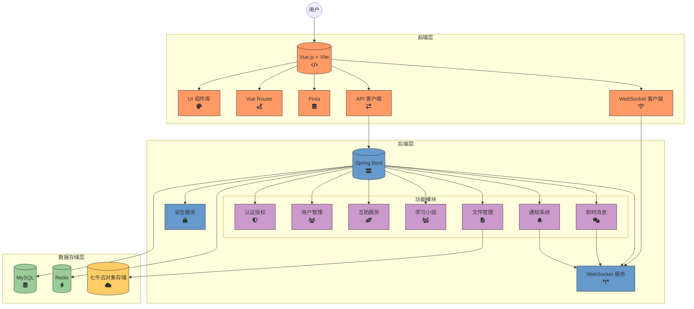

# "学伴"校园互助与资源共享平台 - 软件需求规格说明书（重构版）

## 1. 引言

### 1.1 目的

本文档基于"学伴"校园互助与资源共享平台的实际实现状态，重新定义平台的功能需求、非功能需求、接口需求及其他相关需求。本文档反映了项目的真实技术架构和已实现功能，包括好友系统、私信功能、WebSocket实时通信、管理员后台等核心模块。

### 1.2 项目范围

本平台是一个基于现代Web技术栈的校园互助与资源共享应用程序，主要功能包括：

**核心功能模块：**
- 用户认证与管理系统
- 好友系统（好友申请、接受、拒绝）
- 私信系统（实时消息传递）
- 互助信息发布与管理
- 学习小组创建与管理
- 通知系统（WebSocket实时推送）
- 管理员后台（用户管理、数据统计）
- 文件上传与管理（七牛云OSS集成）
- 信用评价体系

**技术特色：**
- WebSocket实时通信支持
- Redis缓存系统
- Docker容器化部署
- 分布式文件存储（七牛云）
- 前后端完全分离架构

### 1.3 定义、首字母缩写词和缩略语

- **SRS**: Software Requirements Specification (软件需求规格说明书)
- **平台**: 指"学伴"校园互助与资源共享平台
- **用户**: 指在平台上注册并使用其服务的在校学生
- **好友系统**: 用户之间建立好友关系的功能模块
- **私信**: 用户之间的实时一对一消息通信
- **WebSocket**: 提供实时双向通信的网络协议
- **Redis**: 内存数据库，用于缓存和会话管理
- **OSS**: Object Storage Service (对象存储服务)
- **Docker**: 容器化平台
- **API**: Application Programming Interface
- **Vue 3**: 前端JavaScript框架
- **Spring Boot 3**: Java后端框架
- **Element Plus**: Vue 3 UI组件库
- **MyBatis Plus**: Java持久层框架

### 1.4 参考文献

- Spring Boot 3.x 官方文档
- Vue 3 官方文档
- WebSocket API 规范
- Redis 官方文档
- 七牛云对象存储API文档
- Docker 官方文档

### 1.5 文档概述

本文档描述了基于实际实现的平台功能需求。第2章描述产品总体概况；第3章详细列出具体需求；第4章包含其他需求和部署要求。

## 2. 总体描述

### 2.1 产品愿景与目标

"学伴"平台致力于构建一个现代化的校园社交互助生态系统，通过实时通信技术和智能匹配机制，为学生提供便捷的学习协作和资源共享环境。

**核心目标：**
1. **实时互动**: 通过WebSocket技术实现即时消息传递和实时通知
2. **社交网络**: 建立基于好友关系的校园社交网络
3. **智能推荐**: 基于用户行为和兴趣的个性化内容推荐
4. **可靠服务**: 通过缓存和容器化技术保障系统的稳定性和扩展性

### 2.2 产品功能

**已实现的核心功能：**

1. **用户认证与管理**
   - JWT Token认证机制
   - 用户注册、登录、个人信息管理
   - 基于角色的权限控制

2. **好友系统**
   - 好友搜索与推荐
   - 好友申请、接受、拒绝工作流
   - 好友状态管理（PENDING、ACCEPTED、REJECTED）
   - 好友列表展示

3. **私信系统**
   - 实时消息发送与接收
   - WebSocket推送通知
   - 消息已读/未读状态跟踪
   - 消息历史记录

4. **互助信息系统**
   - 互助信息发布、编辑、删除
   - 互助申请与响应管理
   - 分类检索与搜索
   - 状态跟踪（开放中、已完成、已取消）

5. **学习小组功能**
   - 小组创建与管理
   - 成员邀请与审批
   - 小组内容分享
   - 文件上传与下载

6. **通知系统**
   - WebSocket实时通知推送
   - 多类型通知支持（好友申请、消息、系统通知）
   - 通知状态管理

7. **管理员后台**
   - 用户管理与统计
   - 内容审核
   - 系统监控仪表板
   - 数据分析报表

8. **文件管理**
   - 七牛云OSS集成
   - 文件上传、下载、预览
   - 图片处理与压缩
   - 文件权限控制

### 2.3 用户特征

**用户类型：**
- **普通用户**: 在校学生，使用互助、社交、学习功能
- **管理员**: 平台管理人员，负责内容审核和系统维护

**用户特征：**
- 熟悉现代Web应用和移动应用
- 期望快速响应和实时交互体验
- 注重个人隐私和数据安全
- 习惯于社交化的学习协作方式

### 2.4 运行环境

**前端环境：**
- 现代Web浏览器（Chrome 90+, Firefox 88+, Safari 14+, Edge 90+）
- 支持WebSocket和ES6+语法
- 响应式设计支持桌面和移动设备

**后端环境：**
- Java 17+ 运行时环境
- Linux/Windows Server操作系统
- Docker容器化部署支持

**数据存储：**
- MySQL 8.0+ 主数据库
- Redis 6.0+ 缓存数据库
- 七牛云对象存储服务

**网络要求：**
- HTTPS协议支持
- WebSocket连接支持
- 公网访问能力（用于第三方服务集成）

### 2.5 设计与实现约束

**技术架构约束：**
1. **前端技术栈**：Vue 3 + TypeScript + Element Plus + Vite
2. **后端技术栈**：Spring Boot 3 + Spring Security + MyBatis Plus
3. **数据库**：MySQL 8.0 + Redis 6.0
4. **部署方式**：Docker容器化部署
5. **文件存储**：七牛云OSS服务
6. **实时通信**：WebSocket协议

**安全约束：**
- 所有API接口需要身份验证
- 敏感数据传输必须使用HTTPS
- 用户密码采用BCrypt加密存储
- 实施CORS跨域访问控制
- SQL注入和XSS攻击防护

**性能约束：**
- API响应时间 < 500ms (90%请求)
- WebSocket消息延迟 < 100ms
- 支持1000+并发连接
- 数据库查询优化和索引策略

### 2.6 假设和依赖

**技术依赖：**
- 依赖七牛云OSS服务的稳定性和可用性
- 依赖Redis服务用于缓存和会话管理
- 依赖Docker运行环境用于容器化部署
- 依赖WebSocket协议支持用于实时通信

**业务假设：**
- 用户具备基本的网络使用能力
- 校园网络环境支持WebSocket连接
- 用户同意平台隐私政策和服务条款
- 管理员能够及时处理内容审核和用户申诉

### 2.7 系统架构概述

**架构设计原则:**
Campus Buddy平台采用分层架构设计，确保系统的可扩展性、可维护性和高性能。

**架构层次:**

1. **前端表现层**
   - 技术栈：Vue 3 + TypeScript + Element Plus + Vite
   - 责任：用户界面展示、用户交互处理、状态管理
   - 特性：组件化设计、响应式布局、实时通信支持

2. **后端应用层**
   - 技术栈：Spring Boot 3 + Spring Security + MyBatis Plus
   - 责任：业务逻辑处理、API接口提供、权限控制
   - 模块：用户管理、好友系统、互助服务、学习小组、通知系统、文件管理、评价系统

3. **数据存储层**
   - 主数据库：MySQL 8.0 (结构化数据存储)
   - 缓存数据库：Redis 6.0 (会话管理、缓存加速)
   - 对象存储：七牛云OSS (文件存储、CDN加速)

4. **通信机制**
   - HTTP/HTTPS：RESTful API接口通信
   - WebSocket：实时消息推送和通知
   - 内部通信：服务间直接调用和消息队列

**关键架构特性:**
- **模块化设计**: 各功能模块独立开发和部署
- **缓存策略**: 多层缓存提高系统性能
- **实时通信**: WebSocket支持即时消息和通知
- **安全机制**: JWT认证、RBAC权限控制、数据加密
- **容器化部署**: Docker支持一致性部署环境
- **外部服务集成**: 七牛云OSS文件存储服务

## 3. 具体需求

### 3.1 功能需求

#### 3.1.1 用户认证与管理模块 (FR-AUTH)

**FR-AUTH-001: 用户注册**
- **描述**: 支持学号/邮箱注册，包含基本信息验证
- **输入**: 学号、邮箱、密码、确认密码、昵称
- **处理**: 
  - 验证学号/邮箱唯一性
  - 密码强度检查
  - BCrypt密码加密存储
  - 创建用户默认角色
- **输出**: 注册成功返回用户信息，失败返回错误提示

**FR-AUTH-002: 用户登录**
- **描述**: JWT Token认证登录机制
- **输入**: 学号/邮箱、密码
- **处理**:
  - 验证用户凭据
  - 生成JWT访问令牌和刷新令牌
  - 记录登录日志
- **输出**: 返回Token和用户基本信息

**FR-AUTH-003: Token刷新**
- **描述**: 自动刷新过期的访问令牌
- **输入**: 刷新令牌
- **处理**: 验证刷新令牌有效性，生成新的访问令牌
- **输出**: 新的访问令牌

**FR-AUTH-004: 个人信息管理**
- **描述**: 用户可查看和编辑个人资料
- **功能**:
  - 头像上传（七牛云OSS）
  - 个人信息编辑（昵称、专业、年级、签名等）
  - 隐私设置管理
  - 技能标签管理

#### 3.1.2 好友系统模块 (FR-FRIEND)

**FR-FRIEND-001: 好友搜索**
- **描述**: 根据用户名、学号、专业等条件搜索用户
- **输入**: 搜索关键词、筛选条件
- **处理**: 
  - 分页查询用户列表
  - 排除已是好友的用户
  - 支持模糊匹配和精确匹配
- **输出**: 用户搜索结果列表

**FR-FRIEND-002: 发送好友申请**
- **描述**: 向其他用户发送好友申请
- **输入**: 目标用户ID、申请留言
- **处理**:
  - 检查是否已存在待处理申请
  - 创建好友申请记录
  - WebSocket实时通知目标用户
- **输出**: 申请发送成功确认

**FR-FRIEND-003: 处理好友申请**
- **描述**: 接受或拒绝收到的好友申请
- **输入**: 申请ID、处理结果（ACCEPTED/REJECTED）
- **处理**:
  - 更新申请状态
  - 如接受，创建双向好友关系
  - WebSocket通知申请发送方
- **输出**: 处理结果确认

**FR-FRIEND-004: 好友列表管理**
- **描述**: 查看和管理好友列表
- **功能**:
  - 分页显示好友列表
  - 好友在线状态显示
  - 好友信息快速查看
  - 删除好友功能

#### 3.1.3 私信系统模块 (FR-MESSAGE)

**FR-MESSAGE-001: 发送私信**
- **描述**: 向好友发送实时私信
- **输入**: 接收者ID、消息内容、消息类型（文本/图片/文件）
- **处理**:
  - 验证好友关系
  - 存储消息记录
  - WebSocket实时推送
  - 更新会话最后消息时间
- **输出**: 消息发送状态确认

**FR-MESSAGE-002: 接收私信**
- **描述**: 实时接收好友私信
- **处理**:
  - WebSocket监听消息推送
  - 自动更新消息列表
  - 声音和视觉通知
  - 消息计数更新
- **输出**: 实时消息展示

**FR-MESSAGE-003: 消息历史**
- **描述**: 查看与特定好友的聊天历史
- **输入**: 好友ID、分页参数
- **处理**:
  - 分页加载历史消息
  - 支持向上滚动加载更多
  - 消息时间排序
- **输出**: 历史消息列表

**FR-MESSAGE-004: 已读状态管理**
- **描述**: 跟踪消息的已读/未读状态
- **处理**:
  - 自动标记查看过的消息为已读
  - 统计未读消息数量
  - WebSocket通知发送方已读状态
- **输出**: 已读状态显示

#### 3.1.4 互助信息模块 (FR-HELP)

**FR-HELP-001: 发布互助信息**
- **描述**: 发布求助或提供帮助的信息
- **输入**: 标题、内容、类型、标签、联系方式、图片
- **处理**:
  - 内容审核和过滤
  - 图片上传到七牛云
  - 创建互助记录
  - 索引建立用于搜索
- **输出**: 发布成功确认

**FR-HELP-002: 互助信息浏览**
- **描述**: 浏览平台上的互助信息
- **功能**:
  - 分页显示互助列表
  - 按类型、时间、热度排序
  - 搜索和筛选功能
  - 个性化推荐

**FR-HELP-003: 申请互助**
- **描述**: 对互助信息提交申请
- **输入**: 互助信息ID、申请说明
- **处理**:
  - 创建申请记录
  - 通知信息发布者
  - 更新申请统计
- **输出**: 申请提交确认

**FR-HELP-004: 互助申请管理**
- **描述**: 管理收到的互助申请
- **功能**:
  - 查看申请列表
  - 接受或拒绝申请
  - 标记互助完成
  - 申请者信息查看

#### 3.1.5 学习小组模块 (FR-GROUP)

**FR-GROUP-001: 创建学习小组**
- **描述**: 创建主题化学习小组
- **输入**: 小组名称、描述、头像、加入方式、标签
- **处理**:
  - 创建小组记录
  - 设置创建者为管理员
  - 上传小组头像到OSS
- **输出**: 小组创建成功，返回小组信息

**FR-GROUP-002: 小组成员管理**
- **描述**: 管理小组成员和权限
- **功能**:
  - 邀请用户加入小组
  - 审批加入申请
  - 设置成员角色和权限
  - 移除小组成员

**FR-GROUP-003: 小组内容分享**
- **描述**: 在小组内分享学习资源和讨论
- **功能**:
  - 发布小组帖子
  - 文件资源分享
  - 评论和讨论
  - 内容置顶和精华标记

#### 3.1.6 通知系统模块 (FR-NOTIFICATION)

**FR-NOTIFICATION-001: 实时通知推送**
- **描述**: 通过WebSocket推送各类实时通知
- **通知类型**:
  - 好友申请通知
  - 私信通知
  - 互助申请通知
  - 系统公告通知
  - 小组活动通知

**FR-NOTIFICATION-002: 通知中心**
- **描述**: 统一管理所有通知消息
- **功能**:
  - 通知列表分页显示
  - 按类型筛选通知
  - 批量标记已读
  - 通知详情查看
  - 通知删除管理

**FR-NOTIFICATION-003: 通知设置**
- **描述**: 用户可自定义通知偏好
- **功能**:
  - 通知类型开关
  - 免打扰时间设置
  - 声音通知设置
  - 邮件通知设置

#### 3.1.7 管理员后台模块 (FR-ADMIN)

**FR-ADMIN-001: 用户管理**
- **描述**: 管理平台用户账户
- **功能**:
  - 用户列表查看和搜索
  - 用户状态管理（启用/禁用）
  - 用户信息编辑
  - 用户行为日志查看

**FR-ADMIN-002: 内容管理**
- **描述**: 管理平台内容和审核
- **功能**:
  - 互助信息审核
  - 违规内容处理
  - 用户举报处理
  - 敏感词过滤管理

**FR-ADMIN-003: 数据统计**
- **描述**: 平台运营数据统计和分析
- **功能**:
  - 用户增长统计
  - 活跃度分析
  - 功能使用统计
  - 数据可视化图表

#### 3.1.8 文件管理模块 (FR-FILE)

**FR-FILE-001: 文件上传**
- **描述**: 集成七牛云OSS的文件上传功能
- **功能**:
  - 支持图片、文档、音视频上传
  - 文件类型和大小限制
  - 上传进度显示
  - 断点续传支持

**FR-FILE-002: 文件处理**
- **描述**: 自动处理上传的文件
- **功能**:
  - 图片压缩和格式转换
  - 文件安全检查
  - 生成缩略图
  - 文件访问权限控制

#### 3.1.9 评价系统模块 (FR-REVIEW)

**FR-REVIEW-001: 互助评价**
- **描述**: 互助完成后进行双向评价
- **输入**: 互助信息ID、评分(1-5分)、评价内容
- **处理**:
  - 验证评价资格（参与过该互助）
  - 防止重复评价同一互助
  - 更新用户信用评分
  - 记录评价历史
- **输出**: 评价提交成功，信用分更新

**FR-REVIEW-002: 评价类型管理**
- **描述**: 支持不同模块的评价类型
- **评价类型**:
  - PUBLISHER_TO_HELPER: 发布者评价帮助者
  - HELPER_TO_PUBLISHER: 帮助者评价发布者
  - GROUP_MEMBER_REVIEW: 小组成员互评（扩展功能）
- **处理**:
  - 根据用户角色确定评价类型
  - 验证评价权限和时效性
  - 计算加权信用评分

**FR-REVIEW-003: 信用评分系统**
- **描述**: 基于评价计算用户信用评分
- **评分规则**:
  - 初始信用分100分
  - 好评(4-5分)：+2分
  - 中评(3分)：+1分
  - 差评(1-2分)：-3分
  - 被举报恶意行为：-10分
- **处理**:
  - 实时更新用户信用分
  - 设置信用分上下限(0-200分)
  - 信用分影响平台权限
- **输出**: 用户信用等级和相关权限

**FR-REVIEW-004: 评价查看和管理**
- **描述**: 查看收到的评价和评价历史
- **功能**:
  - 查看评价列表和详情
  - 按模块类型筛选评价
  - 评价统计数据展示
  - 评价申诉功能（恶意评价处理）

### 3.2 非功能需求

#### 3.2.1 性能需求

**NFR-PERF-001: 响应时间**
- API接口响应时间 < 500ms (90%请求)
- 页面加载时间 < 2秒
- WebSocket消息延迟 < 100ms
- 数据库查询时间 < 200ms

**NFR-PERF-002: 并发处理能力**
- 支持1000+并发用户在线
- 支持500+并发WebSocket连接
- 数据库连接池优化
- Redis缓存命中率 > 90%

**NFR-PERF-003: 系统吞吐量**
- API请求处理能力 > 1000 QPS
- 文件上传处理能力 > 100 MB/s
- 消息推送能力 > 10000条/分钟

#### 3.2.2 安全性需求

**NFR-SEC-001: 认证授权**
- JWT Token机制，Token有效期管理
- 基于角色的访问控制(RBAC)
- API接口权限验证
- 敏感操作二次确认

**NFR-SEC-002: 数据保护**
- HTTPS加密传输
- 密码BCrypt加密存储
- 个人信息脱敏处理
- 数据备份和恢复机制

**NFR-SEC-003: 攻击防护**
- SQL注入防护
- XSS攻击防护
- CSRF攻击防护
- API频率限制和防刷

#### 3.2.3 可用性需求

**NFR-USAB-001: 用户体验**
- 直观的用户界面设计
- 响应式布局适配
- 操作流程简化
- 错误提示友好

**NFR-USAB-002: 系统稳定性**
- 系统可用性 > 99.9%
- 故障自动恢复机制
- 优雅降级处理
- 监控告警系统

#### 3.2.4 可扩展性需求

**NFR-EXT-001: 架构扩展**
- 微服务架构支持
- 水平扩展能力
- 负载均衡支持
- 数据库读写分离

**NFR-EXT-002: 功能扩展**
- 插件化功能模块
- API版本兼容
- 第三方服务集成
- 多端适配支持

#### 3.2.5 缓存性能需求

**NFR-CACHE-001: 缓存策略**
- Redis缓存命中率 > 90%
- 热点数据缓存响应时间 < 10ms
- 缓存数据一致性保证
- 缓存失效和更新策略优化

**NFR-CACHE-002: 缓存分类管理**
- 用户信息缓存：TTL 1小时，写透策略
- 互助信息缓存：TTL 5-10分钟，写透策略
- 小组帖子缓存：TTL变动，基于更新频率
- 会话令牌缓存：TTL与令牌生命周期一致

**NFR-CACHE-003: 分布式缓存**
- 支持多节点Redis集群
- 缓存数据分片策略
- 缓存故障转移机制
- 缓存监控和性能分析

#### 3.2.6 WebSocket实时通信需求

**NFR-WS-001: 连接管理**
- 支持500+并发WebSocket连接
- 连接心跳机制，30秒间隔
- 自动断线重连，最多重试5次
- 连接状态监控和统计

**NFR-WS-002: 消息推送性能**
- 消息推送延迟 < 100ms
- 支持10000条/分钟消息推送
- 消息可靠性保证，防止丢失
- 消息去重和幂等性处理

**NFR-WS-003: 通知类型支持**
- 好友申请通知（实时推送）
- 私信消息通知（实时推送）
- 互助申请通知（实时推送）
- 系统公告通知（广播推送）
- 小组活动通知（群组推送）

### 3.3 接口需求

#### 3.3.1 用户界面要求

**UI-001: 设计风格**
- 基于Element Plus设计语言
- 现代化扁平设计风格
- 一致的色彩和字体规范
- 支持明暗主题切换

**UI-002: 响应式设计**
- 适配桌面端（1920x1080, 1366x768等）
- 适配平板端（iPad等）
- 适配移动端（手机屏幕）
- 触摸操作友好

**UI-003: 交互体验**
- 流畅的页面切换动画
- 实时状态反馈
- 操作确认提示
- 快捷键支持

#### 3.3.2 API接口要求

**API-001: RESTful设计**
- 遵循REST架构风格
- 统一的响应格式
- HTTP状态码规范使用
- API版本管理

**API-002: 文档规范**
- Swagger/OpenAPI文档
- 接口参数详细说明
- 错误码定义
- 示例代码提供

**API-003: WebSocket接口**
- 连接认证机制
- 消息格式标准化
- 心跳保活机制
- 断线重连处理

#### 3.3.3 第三方集成接口

**THIRD-001: 七牛云OSS**
- 文件上传接口
- 文件访问接口
- 图片处理接口
- CDN加速服务

**THIRD-002: 扩展接口**
- 邮件服务接口（可选）
- 短信服务接口（可选）
- 推送服务接口（可选）
- 地图服务接口（可选）

### 3.4 数据需求

#### 3.4.1 数据模型

**核心实体关系:**

根据实际实现，系统包含以下15个核心实体：

1. **User (用户)**
   - 用户基本信息：用户名、密码、昵称、头像等
   - 扩展信息：性别、专业、年级、联系方式、技能标签
   - 状态管理：信用评分、账户状态、角色权限

2. **HelpInfo (互助信息)**
   - 基本信息：标题、描述、类型、联系方式
   - 业务信息：期望时间、地点、悬赏金额、图片
   - 状态管理：开放、进行中、已解决、已过期、已关闭

3. **HelpApplication (互助申请)**
   - 申请信息：申请者、互助信息、申请附言
   - 状态管理：待处理、已接受、已拒绝、已取消

4. **StudyGroup (学习小组)**
   - 基本信息：名称、描述、头像、创建者
   - 配置信息：加入方式、分类、标签
   - 统计信息：成员数量、帖子数量

5. **GroupMember (小组成员)**
   - 关系信息：小组ID、用户ID、角色
   - 状态管理：活跃、待批准、已禁止

6. **GroupPost (小组帖子)**
   - 内容信息：标题、正文、内容类型
   - 互动数据：点赞数、评论数、浏览数
   - 状态管理：已发布、已删除

7. **PostComment (帖子评论)**
   - 评论内容：评论正文、父评论ID（支持嵌套回复）
   - 状态管理：已发布、已删除

8. **PostLike (帖子点赞)**
   - 点赞关系：用户ID、帖子ID、点赞时间
   - 约束：一个用户对一个帖子只能点赞一次

9. **Friend (好友关系)**
   - 好友关系：用户ID、好友ID、建立时间
   - 双向关系：需要创建两条记录

10. **FriendRequest (好友申请)**
    - 申请信息：申请者、接收者、申请消息
    - 状态管理：待处理、已接受、已拒绝

11. **PrivateMessage (私信)**
    - 消息内容：发送者、接收者、消息正文
    - 消息类型：文本、图片、表情
    - 状态管理：已读、未读

12. **Notification (通知)**
    - 通知信息：接收者、发送者、标题、内容
    - 通知类型：好友申请、互助申请、系统消息等
    - 状态管理：已读、未读、相关资源ID

13. **GroupFile (小组文件)**
    - 文件信息：文件名、类型、大小、存储路径
    - 业务信息：上传者、所属小组、描述
    - 统计信息：下载次数、上传时间

14. **Review (评价)**
    - 评价信息：评价者、被评价者、评分、内容
    - 业务关联：关联的互助信息ID、模块类型
    - 评价类型：发布者评价帮助者、帮助者评价发布者

15. **UserRole (用户角色)**
    - 角色关系：用户ID、角色名称
    - 权限管理：支持一个用户拥有多个角色

**实体关系约束:**
- 用户与其他所有实体都有关联关系（创建者、参与者等）
- 互助信息与互助申请是一对多关系
- 学习小组与成员、帖子、文件都是一对多关系
- 帖子与评论、点赞是一对多关系
- 用户之间通过好友关系、好友申请、私信建立社交网络
- 评价系统关联用户和具体的业务模块（互助、小组等）

#### 3.4.2 数据存储需求

**MySQL主数据库需求:**
- 支持事务一致性（ACID属性）
- 表结构设计符合第三范式
- 建立适当的索引优化查询性能：
  - 主键索引：所有表的主键字段
  - 外键索引：用户ID、小组ID等关联字段
  - 唯一索引：用户名、(用户ID, 角色名称)组合等
  - 普通索引：经常查询的字段如创建时间、状态等
- 支持分页查询和复杂联表查询
- 数据备份和恢复机制

**Redis缓存需求:**
- 用户会话信息缓存（JWT令牌管理）
- 热点数据缓存：
  - 用户基本信息缓存（1小时TTL）
  - 互助信息列表缓存（5-10分钟TTL）
  - 小组帖子缓存（变化频率相关TTL）
- WebSocket连接管理
- 分布式锁实现（防止并发问题）
- 消息队列支持（高并发场景）

**七牛云OSS存储需求:**
- 用户头像存储和CDN加速
- 互助信息相关图片存储
- 小组文件资源存储
- 系统静态资源存储
- 图片处理功能：压缩、格式转换、缩略图生成
- 访问权限控制和防盗链机制

#### 3.4.3 数据安全要求

**敏感数据保护:**
- 用户密码使用BCrypt加密存储
- 个人隐私信息脱敏处理
- API接口数据传输HTTPS加密
- 数据库连接加密

**数据完整性:**
- 外键约束保证数据关联完整性
- 数据验证规则防止无效数据
- 事务管理保证操作原子性
- 定期数据一致性检查

**访问控制:**
- 基于角色的数据访问控制
- 用户只能访问有权限的数据
- 审计日志记录敏感操作
- 数据变更追踪机制

## 4. 部署和运维需求

### 4.1 部署架构

**容器化部署:**
- Docker容器化应用
- Docker Compose编排
- 微服务独立部署
- 环境一致性保证

**环境配置:**
- 开发环境（Development）
- 测试环境（Testing）  
- 生产环境（Production）
- 配置文件分离管理

### 4.2 监控和日志

**系统监控:**
- 应用性能监控（APM）
- 服务器资源监控
- 数据库性能监控
- 接口调用监控

**日志管理:**
- 结构化日志输出
- 日志级别分类
- 日志文件轮转
- 日志聚合分析

### 4.3 备份和恢复

**数据备份:**
- 数据库定期备份
- 增量备份策略
- 异地备份存储
- 备份有效性验证

**灾难恢复:**
- 故障快速检测
- 自动故障转移
- 数据恢复流程
- 业务连续性保障

## 5. 项目交付要求

### 5.1 交付物清单

**文档交付:**
- 软件需求规格说明书（本文档）
- 软件设计规格说明书
- 数据库设计文档
- API接口文档
- 部署运维手册
- 用户使用手册

**代码交付:**
- 前端源代码（Vue 3 + TypeScript）
- 后端源代码（Spring Boot 3 + Java）
- 数据库脚本（MySQL DDL/DML）
- 配置文件和环境配置
- Docker部署脚本

**测试交付:**
- 单元测试代码
- 集成测试用例
- 性能测试报告
- 安全测试报告

### 5.2 验收标准

**功能验收:**
- 所有核心功能正常运行
- 用户界面友好易用
- 数据操作准确无误
- 异常情况处理恰当

**性能验收:**
- 响应时间满足要求
- 并发处理能力达标
- 系统稳定性良好
- 资源使用合理

**安全验收:**
- 身份认证机制有效
- 数据传输加密保护
- 常见攻击防护到位
- 权限控制严格执行